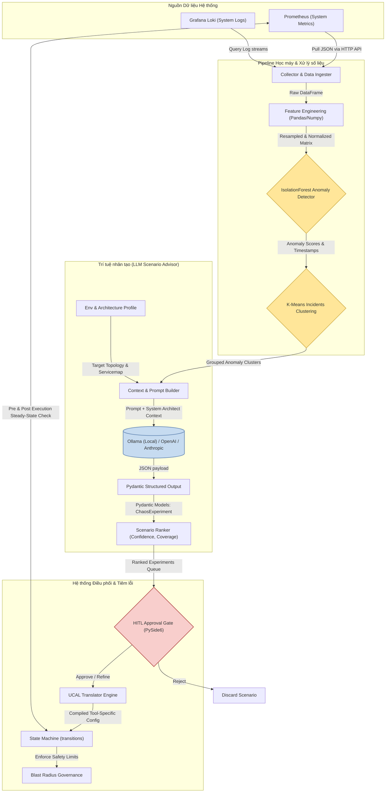
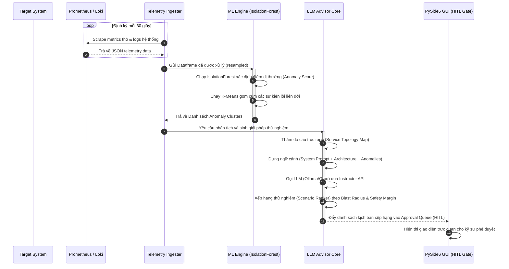
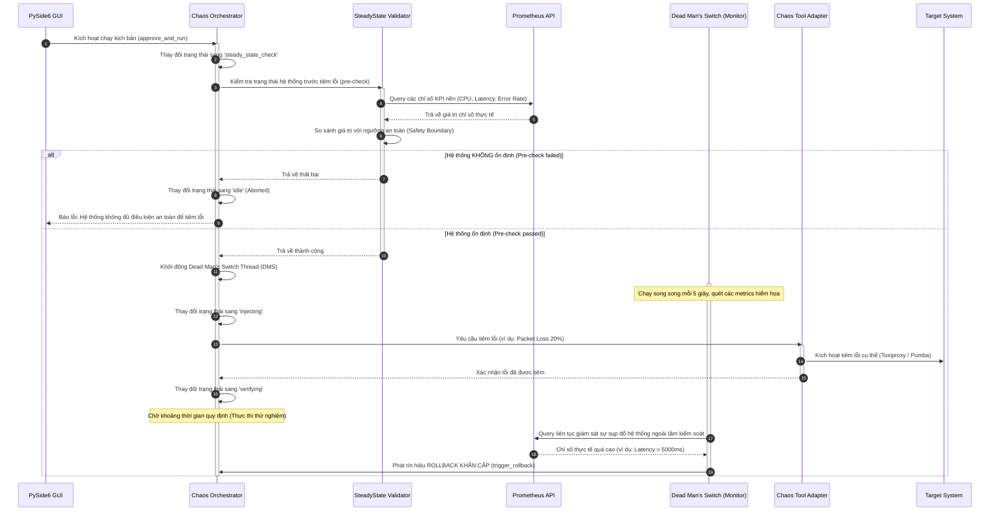
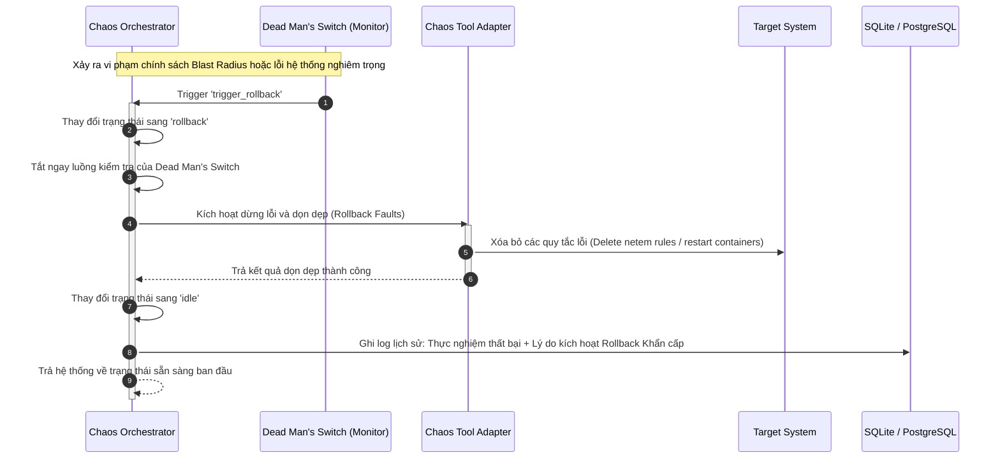
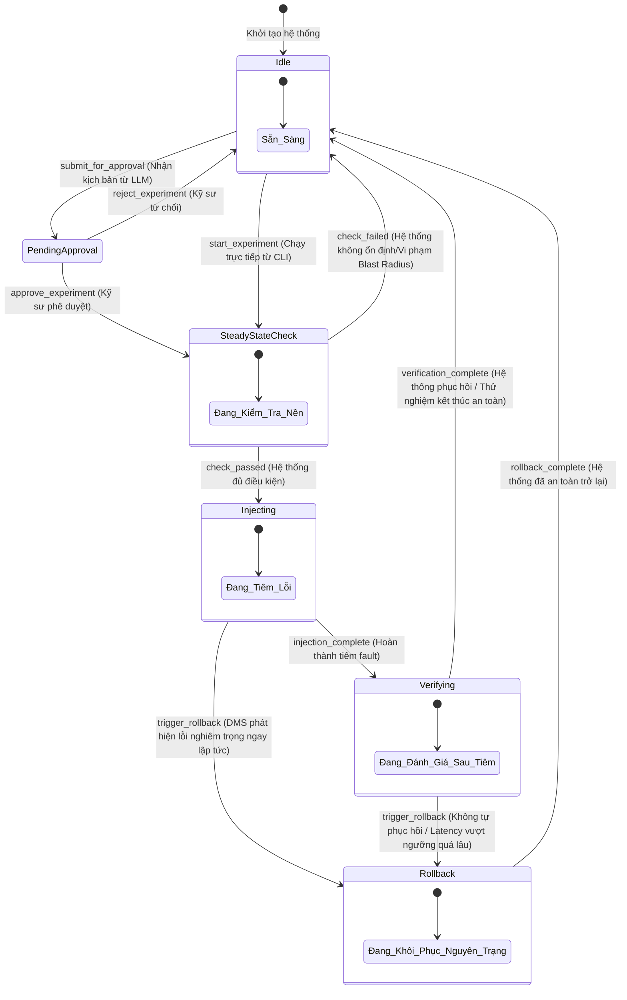
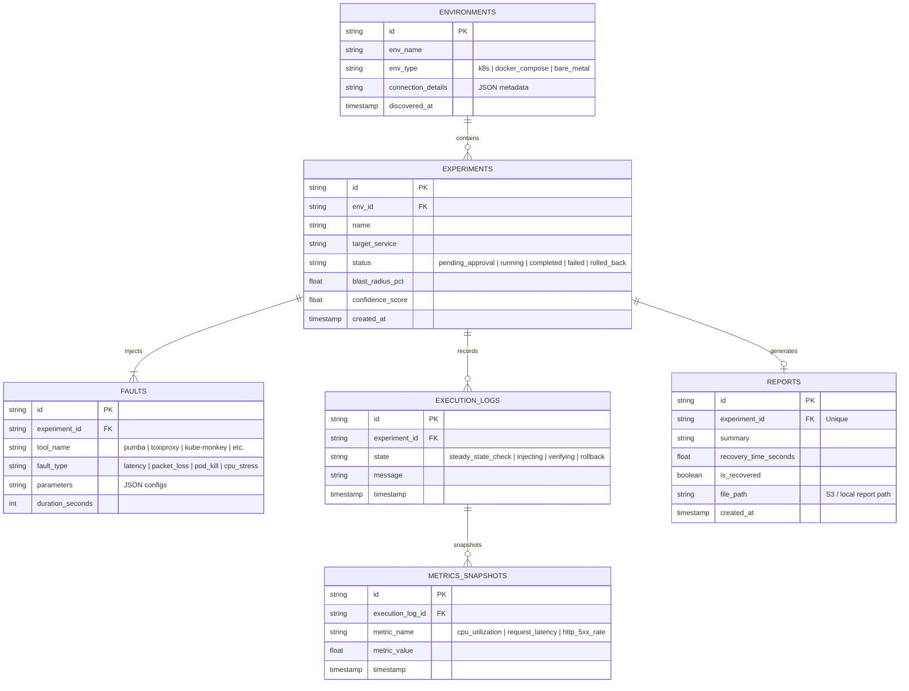
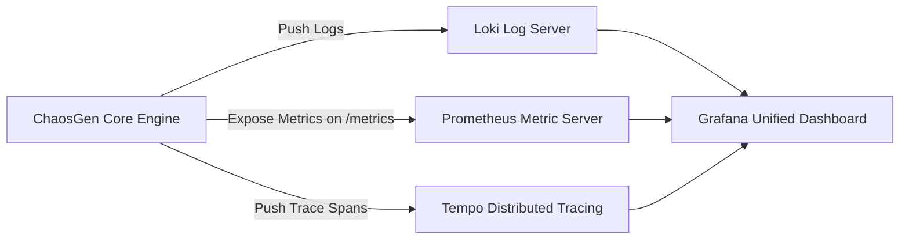
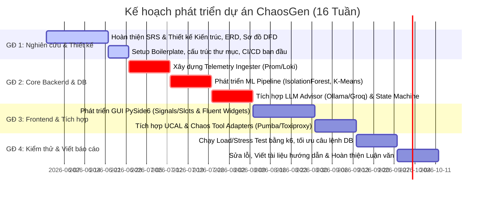

# ĐỒ ÁN TỐT NGHIỆP: THIẾT KẾ VÀ TRIỂN KHAI HỆ THỐNG TỰ ĐỘNG HÓA VÀ TỐI ƯU HÓA THỬ NGHIỆM ĐỘ BỀN (CHAOS ENGINEERING) DỰA TRÊN TRÍ TUỆ NHÂN TẠO (AI-DRIVEN)
## TÊN DỰ ÁN: AIO-CHAOS-TOOL (CHAOSGEN)

---

## 1. TỔNG QUAN KIẾN TRÚC HỆ THỐNG (SYSTEM ARCHITECTURE OVERVIEW)

Hệ thống **ChaosGen** được xây dựng dựa trên nguyên lý **Phân tách trách nhiệm (Separation of Concerns)** và kiến trúc **Loose Coupling (Liên kết lỏng)**. Hệ thống cho phép tự động hóa toàn diện từ khâu thăm dò môi trường, phát hiện bất thường, phân tích đưa ra giả thuyết lỗi bằng AI đến khâu biên dịch và điều phối thử nghiệm hỗn loạn (Chaos Engineering) có sự phê duyệt của con người (Human-in-the-Loop - HITL).

### 1.1 Sơ đồ Kiến trúc Tổng thể (High-Level Architecture)

Dưới đây là sơ đồ kết nối dòng chảy nghiệp vụ từ các lớp tương tác đầu cuối (Clients) qua các dịch vụ trung gian, lớp xử lý trung tâm, lớp cơ sở dữ liệu và hạ tầng thử nghiệm:

```mermaid
graph TD
    %% Clients Layer
    subgraph Clients["TẦNG TRÌNH DIỄN (PRESENTATION LAYER)"]
        GUI["PySide6 Fluent Desktop Application"]
        CLI["Command Line Interface (Click CLI)"]
    end

    %% Gateway & Control Layer
    subgraph Control_Layer["TẦNG ĐIỀU PHỐI & CỔNG GIAO TIẾP (API & ORCHESTRATION GATEWAY)"]
        AGW["ChaosGen API Gateway & Core API"]
        Orch["Event-Driven Orchestrator (State Machine)"]
        SMS["Dead Man's Switch (Safety Monitoring)"]
        BlastCtrl["Blast Radius Controller (Safety Governance)"]
    end

    %% Application/Business Layer
    subgraph App_Services["TẦNG XỬ LÝ NGHIỆP VỤ (APPLICATION LOGIC LAYER)"]
        EnvProbe["Environment & Arch Prober"]
        MLPipeline["ML Pipeline (IsolationForest + K-Means)"]
        LLMAdvisor["LLM Advisor Core (Instructor + Pydantic)"]
        UCAL["Universal Chaos Abstraction Layer (UCAL)"]
    end

    %% Data & Telemetry Caching
    subgraph Data_Storage["TẦNG LƯU TRỮ VÀ TELEMETRY (DATA ACCESS & TELEMETRY LAYER)"]
        DB[("Structured DB (SQLite / PostgreSQL)")]
        RedisCache[("Redis Caching & Concurrency Lock")]
        TSDB[("Prometheus / Loki (Time Series TSDB)")]
        ObjStore[("MinIO / Amazon S3 (Reports & Logs Storage)")]
    end

    %% Targets & Execution Layer
    subgraph Target_Infras["HẠ TẦNG & TỔNG HỢP CÔNG CỤ FAULT INJECTION (EXECUTION LAYER)"]
        Kubernetes["Kubernetes Cluster (K3s/Bare-Metal)"]
        DockerCompose["Docker Compose Environment"]
        BareMetal["Bare Metal & VM Nodes"]
        
        subgraph Chaos_Adapters["Chaos Tool Adapters"]
            Pumba["Pumba (Container Chaos)"]
            Toxiproxy["Toxiproxy (Network Faults)"]
            ChaosTK["Chaos Toolkit (Declarative Engine)"]
            KubeMonkey["Kube-Monkey (Pod Terminator)"]
            ChaosMonkey["Chaos Monkey (VM Terminator)"]
            Muxy["Muxy (HTTP/TCP Injector)"]
        end
    end

    %% Connections
    GUI -->|REST API / WebSockets| AGW
    CLI -->|Local Method Call / API| AGW
    AGW --> Orch
    Orch <--> BlastCtrl
    Orch <--> SMS
    
    Orch --> EnvProbe
    Orch --> MLPipeline
    Orch --> LLMAdvisor
    Orch --> UCAL
    
    EnvProbe -->|Scrape / Query| TSDB
    MLPipeline -->|Scrape Metrics & Logs| TSDB
    LLMAdvisor -->|Ollama Local / Cloud LLM API| RedisCache
    
    Orch -->|Write Execution Logs| DB
    Orch -->|Cache Active States / Locks| RedisCache
    Orch -->|Store PDF Reports / Artifacts| ObjStore
    
    UCAL --> Chaos_Adapters
    
    %% Injection Targets
    Pumba -->|Inject container faults| DockerCompose
    Toxiproxy -->|Inject network proxy faults| BareMetal
    KubeMonkey -->|Inject pod kills| Kubernetes
    ChaosMonkey -->|Kill instances| BareMetal
    ChaosTK -->|Execute scenarios| Kubernetes
    Muxy -->|Inject API layer faults| DockerCompose
    
    classDef client fill:#d4ebf2,stroke:#333,stroke-width:2px;
    classDef control fill:#fce4d6,stroke:#333,stroke-width:2px;
    classDef app fill:#e2efda,stroke:#333,stroke-width:2px;
    classDef data fill:#fff2cc,stroke:#333,stroke-width:2px;
    classDef target fill:#ebebeb,stroke:#333,stroke-width:1px;
    
    class GUI,CLI client;
    class AGW,Orch,SMS,BlastCtrl control;
    class EnvProbe,MLPipeline,LLMAdvisor,UCAL app;
    class DB,RedisCache,TSDB,ObjStore data;
    class Kubernetes,DockerCompose,BareMetal target;
```



---

### 1.2 Đặc tả các Components nội bộ

#### A. Presentation Layer (Tầng Trình diễn)
*   **Công nghệ sử dụng:** **PySide6 (Qt for Python)** và **PySide6-Fluent-Widgets**.
*   **Cơ chế Render:** Client-Side Native Desktop Rendering. Thay vì sử dụng các framework Web-based nặng nề và tiêu tốn bộ nhớ (như Electron), PySide6 cung cấp các widget C++ gốc cực kỳ nhanh, mượt mà và trực quan hóa chính xác các tài nguyên hệ thống ở môi trường local.
*   **Giải pháp State Management (Quản lý trạng thái):**
    *   Sử dụng cơ chế **Signals & Slots** của Qt làm trục xương sống để đồng bộ bất đồng bộ giữa giao diện người dùng và tiến trình nghiệp vụ ngầm.
    *   Tách biệt hoàn toàn luồng giao diện (Main UI Thread) khỏi các tác vụ I/O nặng (như truy vấn Prometheus, chạy mô hình ML phân tích dị thường, hay kích hoạt thử nghiệm) bằng việc ứng dụng **QThread** và **ThreadPool/QRunnable**.
    *   Các sự kiện cập nhật trạng thái của máy trạng thái (State Machine) được đẩy vào GUI thông qua cơ chế Event-driven Signals, loại bỏ hoàn toàn hiện tượng đóng băng giao diện (UI freezing) khi đang tiêm lỗi.

#### B. Application/Business Logic Layer (Tầng Nghiệp vụ cốt lõi)
*   **Cách tổ chức mã nguồn:** Áp dụng **Clean Architecture** kết hợp định hướng **Domain-Driven Design (DDD)**. Mã nguồn được chia thành các Layer cô lập:
    *   *Domain (Core Enterprise Logic):* Định nghĩa các thực thể (Entities) cốt lõi như `ChaosExperiment`, `FaultScenario`, `SafetyPolicy` đảm bảo không bị ảnh hưởng bởi bất kỳ thư viện ngoài nào.
    *   *Application (Use Cases):* Các dịch vụ điều phối như `ChaosOrchestrator`, `LLMAdvisor`, `TelemetryCollector`.
    *   *Infrastructure (Adapters & Integrations):* Trình điều khiển chi tiết cho Docker, K8s, Prometheus, Loki và các Chaos Tool Adapter bên ngoài.
*   **Giải pháp xử lý bất đồng bộ (Asynchronous processing):**
    *   Bên cạnh các Worker Thread của Qt ở phía client, phần nhân điều phối sử dụng thư viện **`asyncio`** của Python.
    *   Sử dụng thư viện **`transitions`** để hiện thực hóa máy trạng thái hữu hạn bất đồng bộ (Event-Driven State Machine). Mọi bước chuyển từ `idle` sang `steady_state_check`, `injecting`, `verifying` hay tự động kích hoạt `rollback` đều được bảo đảm toàn vẹn nhờ cơ chế transition lock, ngăn chặn hoàn toàn việc chạy đè hoặc xung đột kịch bản.

#### C. Data Access Layer (Tầng Truy cập và Tích hợp Dữ liệu)
*   **Cơ chế giao tiếp Database:** Sử dụng **SQLAlchemy ORM** để tương tác với Cơ sở dữ liệu quan hệ (SQLite cho môi trường standalone gọn nhẹ, hỗ trợ chuyển đổi sang PostgreSQL cho môi trường server phân tán).
*   **Giải pháp tối ưu hóa truy vấn:**
    *   *Indexing:* Đánh chỉ mục B-Tree trên các trường tần suất cao như thời điểm chạy (`created_at`), trạng thái thực nghiệm (`status`), và định danh môi trường (`environment_id`).
    *   *Bulk Operation:* Quá trình ghi nhận các điểm dị thường (anomaly logs) từ máy học được thực hiện thông qua cơ chế Bulk Insert để tránh hiện tượng nghẽn I/O (bottleneck) tại cơ sở dữ liệu.
    *   *Telemetry Ingestion:* Giao tiếp trực tiếp bằng thư viện `requests` tối ưu hóa kết nối (connection pooling) để truy cập Prometheus HTTP API và Loki HTTP JSON API với cơ chế nén gzip giúp giảm tải băng thông mạng.

---

## 2. PIPELINE DỮ LIỆU & LUỒNG XỬ LÝ (DATA FLOW & SYSTEMS WORKFLOW)

Sức mạnh cốt lõi của ChaosGen nằm ở quy trình khép kín: **Giám sát liên tục $\rightarrow$ Tự động Phát hiện dị thường $\rightarrow$ AI đề xuất kịch bản hỗn loạn tương ứng $\rightarrow$ Tiêm lỗi $\rightarrow$ Kiểm thử khả năng tự phục hồi.**

### 2.1 Sơ đồ Luồng Dữ liệu Tổng thể (Data Flow Diagram - DFD)

Sơ đồ dưới đây đặc tả dòng chảy dữ liệu (Data Pipeline) từ khi thu thập các chỉ số Telemetry thô đến khi biên dịch thành các kịch bản tiêm lỗi hỗn loạn được xếp hạng và thực thi:



---

### 2.2 Quy trình Nghiệp vụ Cốt lõi (Core System Workflows)

Để chứng minh hệ thống hoạt động chặt chẽ, 3 quy trình cốt lõi được mô hình hóa qua Sequence Diagram chi tiết dưới đây:

#### Luồng 1: Tự động Phát hiện, Nhận dạng và Đề xuất Thử nghiệm
Quy trình từ lúc hệ thống quét dữ liệu giám sát cho đến khi đưa ra các kịch bản được đề xuất lên hàng chờ phê duyệt (HITL Gate):



#### Luồng 2: Xử lý và Giám sát Thử nghiệm với cơ chế Phản ứng nhanh
Luồng thực thi thử nghiệm khi được phê duyệt, bao gồm việc kiểm tra độ ổn định nền và kích hoạt Dead Man's Switch (DMS):



#### Luồng 3: Tự động Rollback & Khôi phục khi phát hiện Sự cố
Chi tiết quy trình dừng khẩn cấp và hồi phục nguyên trạng hệ thống:



---

### 2.3 Sơ đồ Máy Trạng thái của Orchestrator (State Machine Diagram)

Trục điều phối cốt lõi kế thừa từ cấu trúc `transitions` của Python được mô tả qua sơ đồ chuyển trạng thái nghiêm ngặt dưới đây:



---

## 3. THIẾT KẾ CƠ SỞ DỮ LIỆU & LƯU TRỮ (DATABASE & STORAGE DESIGN)

Hệ thống được thiết kế theo cấu trúc lưu trữ lai (**Hybrid Storage Strategy**) để đáp ứng tốc độ ghi nhận chỉ số cao cũng như tính toàn vẹn của dữ liệu báo cáo lịch sử.

### 3.1 Sơ đồ Quan hệ Thực thể (ERD) - Chuẩn hóa 3NF

Cơ sở dữ liệu lưu trữ cấu hình thử nghiệm, lịch sử chạy và các log chi tiết được chuẩn hóa về dạng chuẩn 3 (3NF):



#### Giải thích việc chuẩn hóa dạng chuẩn 3 (3NF) trong thiết kế:
1.  **Dạng chuẩn 1 (1NF):** Mọi thuộc tính đều là các giá trị nguyên tố (atomic). Các cấu hình phức tạp được lưu trữ dưới dạng chuỗi JSON chuẩn hóa hoặc tách thành các quan hệ con (`FAULTS`).
2.  **Dạng chuẩn 2 (2NF):** Mọi thuộc tính phi khóa chính trong tất cả các bảng (như `blast_radius_pct` trong `EXPERIMENTS` hay `recovery_time_seconds` trong `REPORTS`) đều phụ thuộc hoàn toàn vào toàn bộ khóa chính của bảng đó mà không phụ thuộc vào một phần khóa phụ nào.
3.  **Dạng chuẩn 3 (3NF):** Không có sự phụ thuộc bắc cầu (transitive dependency) giữa các thuộc tính phi khóa. Ví dụ, thông tin chi tiết về môi trường (`env_name`, `env_type`) được tách hẳn ra bảng `ENVIRONMENTS` chứ không để trong `EXPERIMENTS`, tránh dư thừa dữ liệu và lỗi cập nhật (update anomalies).

---

### 3.2 Đặc tả NoSQL / Cache Schema (Redis)

Để phục vụ các tính năng thời gian thực và quản lý kiểm soát tần suất, Redis được chọn làm tầng Caching & Distributed Locks.

*   **Redis Strings (Lưu trữ trạng thái khóa & Rate Limiting):**
    *   `rate_limit:ip:<user_ip>`: Lưu trữ số lượng request gọi API từ một IP trong một phút. TTL = 60s. Mục đích: Chống Spam API sinh kịch bản LLM (Rate Limiting).
    *   `lock:environment:<env_id>`: Một cờ khóa phân tán (Distributed Lock) sử dụng lệnh `SET env_lock token NX PX 300000` nhằm ngăn chặn việc tiêm đồng thời 2 thực nghiệm hỗn loạn lên cùng một cụm tài nguyên.
*   **Redis Hashes (Lưu trữ ngữ cảnh thử nghiệm hiện tại):**
    *   `experiment:active:<experiment_id>`:
        *   `state`: Trạng thái chạy hiện tại (`injecting`).
        *   `started_at`: Thời gian bắt đầu thực thi.
        *   `blast_radius_limit`: Giới hạn blast radius thực tế để Dead Man's Switch đối chiếu trực tiếp.
*   **Redis Sorted Sets (Bảng xếp hạng hiệu năng ứng dụng):**
    *   `experiments:leaderboard:blast_radius`: Score là tỷ lệ lỗi/ảnh hưởng hệ thống (`blast_radius_pct`), Value là `experiment_id`. Dùng để kết xuất báo cáo kịch bản nguy hiểm nhất cho hệ thống.

---

### 3.3 Quản lý Dữ liệu lớn / Tệp tin (Object Storage)

*   **Công nghệ lựa chọn:** **MinIO** (môi trường On-Premises/Local/K3s) tương thích hoàn toàn với **Amazon S3 API** (môi trường Production Cloud).
*   **Chiến lược lưu trữ:**
    *   *Static Assets & Charts:* Khi kết xuất báo cáo đánh giá thử nghiệm so sánh A/B (`chaosgen evaluate --ab`), các biểu đồ biểu thị độ trễ hoặc tải CPU dạng ảnh PNG/SVG được đẩy lên bucket `chaosgen-assets/`.
    *   *Raw Telemetry Dump:* Dữ liệu metrics thô thu thập từ Prometheus trong suốt quá trình thử nghiệm dài hơi được nén thành file `.parquet` và lưu trữ tại `chaosgen-raw-telemetry/` phục vụ việc tái huấn luyện (re-training) mô hình IsolationForest trong tương lai.
    *   *PDF Reports:* Toàn bộ báo cáo Thesis/Kỹ thuật được tự động sinh và lưu trữ tại `chaosgen-pdf-reports/` đi kèm mã SHA-256 mã hóa để đối chiếu tính toàn vẹn.

---

## 4. CHI TIẾT TẦNG GIAO TIẾP & API SPECIFICATION

### 4.1 Giao thức Truyền thông (Communication Protocols)

Hệ thống kết hợp linh hoạt 3 giao thức phổ biến để tối ưu hóa hiệu năng truyền tải và độ trễ:

1.  **HTTP/REST (Synchronous):** Sử dụng cho các tác vụ mang tính chất yêu cầu - phản hồi (Request-Response) rõ ràng, như gửi yêu cầu cấu hình, gọi LLM API của Ollama, truy vấn cấu trúc hạ tầng từ Environment Probe và kéo số liệu Prometheus.
2.  **gRPC / Protocol Buffers (Internal Microservices):** Khi triển khai ChaosGen dạng phân tán (Agent daemon-set trên Kubernetes), luồng giao tiếp giữa Agent Node và Orchestrator Engine trung tâm được truyền qua gRPC để giảm thiểu kích thước gói tin (Binary serialization) và tối ưu hóa tài nguyên phần cứng.
3.  **WebSocket (Full-Duplex Real-Time):** Sử dụng để đẩy các luồng sự kiện tiêm lỗi, log thực thi thời gian thực và cảnh báo khẩn cấp từ nhân điều phối (Orchestrator) lên màn hình giám sát PySide6 GUI của quản trị viên mà không cần kéo (polling) liên tục.

---

### 4.2 Tài liệu hóa API (API Contract)

#### A. Thăm dò và Phân loại môi trường (Discover Environment)
*   **Endpoint:** `/api/v1/discover`
*   **Method:** `POST`
*   **Description:** Quét và phân tích hạ tầng đích để xây dựng topo kiến trúc và xác định stack giám sát (observability).
*   **Request Payload (JSON):**
```json
{
  "target_type": "kubernetes",
  "connection_string": "~/.kube/config",
  "namespace_scope": ["default", "production"]
}
```
*   **Response Payload (JSON):**
```json
{
  "status": "success",
  "discovered_at": "2026-05-26T14:47:00Z",
  "environment_profile": {
    "detected_architecture": "microservices",
    "nodes_count": 5,
    "services": ["frontend", "cartservice", "paymentservice", "emailservice"],
    "observability_stack": {
      "prometheus": { "installed": true, "endpoint": "http://prometheus-k8s.monitoring.svc:9090" },
      "loki": { "installed": false, "endpoint": null }
    }
  }
}
```

#### B. Sinh kịch bản thử nghiệm bằng AI (Generate Chaos Scenarios)
*   **Endpoint:** `/api/v1/scenarios/generate`
*   **Method:** `POST`
*   **Description:** Gọi LLM phân tích các dị thường máy học và topo kiến trúc để sinh ra danh sách thử nghiệm hỗn loạn có cấu trúc.
*   **Request Payload (JSON):**
```json
{
  "llm_provider": "ollama",
  "llm_model": "llama3.2:3b",
  "environment_id": "env-k8s-prod-01",
  "anomalies_summary": [
    {
      "severity": "high",
      "affected_service": "paymentservice",
      "metric_anomaly": "http_5xx_rate spike to 12%"
    }
  ]
}
```
*   **Response Payload (JSON):**
```json
{
  "provider": "ollama",
  "scenarios_generated": [
    {
      "experiment_id": "exp-ai-9981",
      "name": "Payment Service Network Latency",
      "confidence_score": 0.89,
      "target": {
        "name": "paymentservice",
        "type": "kubernetes-pod"
      },
      "faults": [
        {
          "tool_name": "toxiproxy",
          "fault_type": "latency",
          "params": {
            "latency": 2000,
            "jitter": 200
          },
          "duration_seconds": 60
        }
      ],
      "steady_state_check": {
        "metric_name": "http_request_duration_seconds",
        "threshold": 0.500
      }
    }
  ]
}
```

#### C. Tinh chỉnh kịch bản thông qua Hội thoại (Refine Scenario)
*   **Endpoint:** `/api/v1/experiments/{id}/refine`
*   **Method:** `PUT`
*   **Description:** Sử dụng prompt ngôn ngữ tự nhiên để tinh chỉnh các thuộc tính trong kịch bản đã sinh trước khi duyệt chạy.
*   **Request Payload (JSON):**
```json
{
  "refinement_prompt": "Giảm thời gian tiêm lỗi xuống còn 30 giây và chỉ tập trung vào port 8080"
}
```
*   **Response Payload (JSON):**
```json
{
  "status": "refined",
  "experiment_id": "exp-ai-9981",
  "updated_faults": [
    {
      "tool_name": "toxiproxy",
      "fault_type": "latency",
      "params": {
        "latency": 2000,
        "port": 8080
      },
      "duration_seconds": 30
    }
  ]
}
```

---

## 5. INFRASTRUCTURE & DEVOPS PIPELINE (HẠ TẦNG VÀ ĐÓNG GÓI)

### 5.1 Chiến lược Ảo hóa và Đóng gói (Containerization)

#### A. Multi-stage Dockerfile tối ưu hóa kích thước
Để chạy ổn định và an toàn trên môi trường Production, Dockerfile của ChaosGen áp dụng kỹ thuật **Multi-stage build** để tách biệt quá trình cài đặt thư viện phụ thuộc (cần các compiler gcc, g++) ra khỏi image chạy cuối cùng (chỉ chứa runtime tối giản, không chứa lỗ hổng bảo mật).

```dockerfile
# Stage 1: Build & Compile dependencies
FROM python:3.10-slim AS builder

WORKDIR /app

RUN apt-get update && apt-get install -y --no-install-recommends \
    build-essential \
    curl \
    && rm -rf /var/lib/apt/lists/*

COPY requirements.txt .
RUN pip install --no-cache-dir --user -r requirements.txt

# Stage 2: Runtime Minimalist Image
FROM python:3.10-slim AS runner

WORKDIR /app

# Sao chép các gói Python đã được build sạch từ stage trước
COPY --from=builder /root/.local /root/.local
COPY . .

ENV PATH=/root/.local/bin:$PATH
ENV PYTHONUNBUFFERED=1

# Cấu hình bảo mật: Chạy dưới quyền User thường (non-root) để bảo vệ Host OS
RUN useradd -u 8888 appuser && chown -R appuser:appuser /app
USER appuser

EXPOSE 8000

ENTRYPOINT ["python", "-m", "chaosgen.cli"]
```

#### B. Quản lý Môi trường Phát triển (Docker Compose)
Tệp tin `docker-compose.yml` định nghĩa môi trường hoàn chỉnh để chạy thử nghiệm tại local bao gồm Core Agent, Prometheus, Grafana, Loki và ứng dụng mock microservice để tiêm lỗi:

```yaml
version: '3.8'

services:
  chaosgen-agent:
    build: .
    volumes:
      - /var/run/docker.sock:/var/run/docker.sock # Cho phép Pumba tiêm lỗi container
      - ~/.chaosgen:/home/appuser/.chaosgen
    environment:
      - PROMETHEUS_URL=http://prometheus:9090
      - LOKI_URL=http://loki:3100
    ports:
      - "8000:8000"
    depends_on:
      - prometheus
      - loki

  prometheus:
    image: prom/prometheus:v2.45.0
    volumes:
      - ./config/prometheus.yml:/etc/prometheus/prometheus.yml
    ports:
      - "9090:9090"

  loki:
    image: grafana/loki:2.8.2
    ports:
      - "3100:3100"
```

---

### 5.2 Orchestration & Hạ tầng Triển khai nâng cao (Kubernetes/K3s)

Khi triển khai trên hệ thống phân tán Kubernetes lớn, chúng tôi sử dụng mô hình kết hợp:
1.  **DaemonSet Chaos Agents:** Triển khai một agent siêu nhẹ trên mỗi Node vật lý để nắm quyền can thiệp sâu vào tầng mạng (cấu hình Linux Traffic Control - `tc`) và tài nguyên của các Pod thuộc node đó.
2.  **Deployment Orchestrator:** Máy chủ chứa API Gateway, ML Engine và State Machine trung tâm để nhận và điều phối kịch bản.

#### Cấp quyền RBAC (Role-Based Access Control) cho Chaos Agent:
Để ChaosGen có quyền can thiệp vào các tài nguyên trong cluster mà không vi phạm quy tắc bảo mật của K8s, một ServiceAccount đi kèm Role chi tiết được đặc tả:

```yaml
apiVersion: rbac.authorization.k8s.io/v1
kind: ClusterRole
metadata:
  name: chaosgen-executor-role
rules:
  # Cấp quyền cho Kube-Monkey phá hủy Pods
  - apiGroups: [""]
    resources: ["pods"]
    verbs: ["get", "list", "watch", "delete"]
  # Cấp quyền thao tác và thay đổi cấu hình Network Policy để tiêm lỗi mạng
  - apiGroups: ["networking.k8s.io"]
    resources: ["networkpolicies"]
    verbs: ["create", "patch", "delete"]
  # Cấp quyền đọc metadata để lập bản đồ dịch vụ (Service Mapping)
  - apiGroups: [""]
    resources: ["services", "endpoints", "namespaces"]
    verbs: ["get", "list", "watch"]
```

---

### 5.3 Luồng CI/CD (Continuous Integration / Continuous Deployment)

Bản vẽ thiết kế quy trình tích hợp và triển khai tự động (GitOps) giúp vận hành sản phẩm trơn tru từ mã nguồn lên cluster chạy thực tế:

```mermaid
flowchart LR
    Push["Developer Push Code"] --> Linter["Linter & Formatter (Black/Flake8)"]
    Linter --> Sonar["SonarQube (Static Code Analysis)"]
    Sonar --> Unit["Unit Tests (Pytest)"]
    Unit --> Build["Docker Buildx Multi-arch"]
    Build --> Registry["Push to Docker Registry"]
    Registry --> Sync["ArgoCD GitOps Sync Alert"]
    Sync --> Deploy["Deploy Helm Chart to K3s Cluster"]
    
    style Push fill:#d4ebf2,stroke:#333;
    style Sonar fill:#ffe699,stroke:#333;
    style Build fill:#e2efda,stroke:#333;
    style Deploy fill:#fce4d6,stroke:#333;
```



*   **SonarQube Quality Gate:** Thiết lập rào cản tối thiểu:
    *   Coverage (độ bao phủ unit test) $> 80\%$.
    *   Zero Security Vulnerabilities (Không có lỗ hổng bảo mật nghiêm trọng).
    *   Code Duplication (Mã trùng lặp) $< 3\%$.
*   **Cơ chế GitOps:** ArgoCD liên tục theo dõi repository chứa Helm Charts của ChaosGen. Bất kỳ thay đổi nào về phiên bản Image tại file values.yaml sẽ lập tức kích hoạt ArgoCD đồng bộ tự động xuống cụm Kubernetes.

---

## 6. MA TRẬN CHẤT LƯỢNG: AN TOÀN BẢO MẬT & HIỆU NĂNG

### 6.1 Chiến lược Bảo mật (Security Strategy)

> [!CAUTION]
> **Rủi ro rò rỉ quyền tối cao:**
> Do một công cụ Chaos Engineering nắm quyền kiểm soát hạ tầng rất cao (có thể xóa pod, can thiệp mạng), việc bảo mật hệ thống là tối quan trọng để ngăn ngừa kẻ xấu lợi dụng biến ChaosGen thành công cụ tấn công phá hoại hạ tầng (DDoS / Ransomware).

*   **Mã hóa dữ liệu:**
    *   *Data-in-Transit:* Bắt buộc cấu hình TLS 1.3 đối với các giao tiếp REST và WebSocket. Mọi cuộc gọi gRPC nội bộ bắt buộc phải sử dụng chứng chỉ mã hóa hai chiều **mTLS (Mutual TLS)**.
    *   *Data-at-Rest:* File lưu trữ API Keys của cloud LLM (`~/.chaosgen/.env`) được mã hóa bằng thuật toán **AES-256-GCM** dựa trên khóa Master Key sinh riêng của từng máy. Tệp tin này được áp đặt quyền hạn nghiêm ngặt `chmod 600` trên môi trường Linux.
*   **Phòng chống lỗ hổng OWASP Top 10:**
    *   *SQL Injection:* Tuyệt đối không cộng chuỗi để tạo Raw Query. Toàn bộ các truy vấn lọc lịch sử thử nghiệm đều được tham số hóa (Parameterized queries) thông qua Pydantic Validation và SQLAlchemy.
    *   *Broken Authentication:* Áp dụng Token JWT có thời hạn ngắn (TTL = 15 phút) đi kèm Refresh Token lưu trữ an toàn trong Secure Storage của hệ điều hành OS (sử dụng thư viện `keyring` của Python).
    *   *Blast Radius Controller (Quy tắc vòng bảo vệ cứng):*
        *   **Cấm Namespace hệ thống:** Cấu hình mặc định cấm tiêm lỗi vào các namespace cốt lõi: `kube-system`, `monitoring`, `kube-public`, `kube-node-lease`.
        *   **Giới hạn phần trăm hủy diệt:** Hard limit tối đa không phá hủy quá $20\%$ số lượng Pod hiện tại của một dịch vụ.

---

### 6.2 Cơ chế Giám sát & Ghi log (Observability Architecture)

Chúng tôi thiết lập stack giám sát **LGTM (Loki, Grafana, Tempo, Mimir)** để theo dõi chặt chẽ hoạt động của chính công cụ ChaosGen:



*   **Loki:** Thu thập toàn bộ log sinh ra từ quá trình điều phối thử nghiệm của `ChaosOrchestrator` để phục vụ việc tra soát (audit trail). Kỹ sư hệ thống có thể kiểm tra chính xác ai đã phê duyệt kịch bản và thời điểm tiêm lỗi.
*   **Tempo:** Do quá trình tiêm lỗi có thể làm ảnh hưởng đến đường đi của request qua nhiều microservices, Tempo giúp theo dõi vết (distributed tracing) sự thay đổi về độ trễ (latency) của từng span cụ thể trong hệ thống đích dưới sự tác động của lỗi.

---

### 6.3 Chiến lược Kiểm thử Hiệu năng (Load/Stress Testing Plan)

Để đảm bảo chính công cụ ChaosGen không làm nghẽn hệ thống (không tạo ra "tải ký sinh" quá mức), chúng tôi sử dụng công cụ **k6** để chạy các kịch bản kiểm thử tải.

*   **Kịch bản đo đạc:** Giả lập $100$ kỹ sư truy cập đồng thời vào Dashboard để theo dõi các metrics thời gian thực được đẩy qua WebSockets, đồng thời kích hoạt $50$ tiến trình khám phá kiến trúc liên tục.
*   **Chỉ số mục tiêu (Non-functional Targets):**

| Chỉ số (KPI) | Giá trị mục tiêu | Mô tả |
| :--- | :--- | :--- |
| **Orchestrator Latency** | $< 50\text{ ms}$ | Thời gian chuyển đổi trạng thái của State Machine khi nhận sự kiện. |
| **API Response Time (p95)** | $< 150\text{ ms}$ | Thời gian phản hồi của các REST API thông thường. |
| **WebSocket Delivery Lag** | $< 100\text{ ms}$ | Độ trễ từ lúc Prometheus nhận chỉ số mới đến khi biểu đồ trên GUI cập nhật. |
| **Max Resource Overhead** | $< 5\%\text{ CPU / } 256\text{MB RAM}$ | Tài nguyên tiêu tốn tối đa của Chaos Agent khi chạy trên hạ tầng đích. |

---

## 7. KẾ HOẠCH PHÁT TRIỂN & CÁC CỘT MỐC (ENGINEERING ROADMAP)

Bản lộ trình 16 tuần xây dựng dự án được chia làm 4 giai đoạn cụ thể, định nghĩa rõ ràng các đầu ra kỹ thuật để đảm bảo tính thực tiễn cao trước Hội đồng:



---

## 8. CÁC ĐIỂM RỦI RO KỸ THUẬT VÀ PHƯƠNG ÁN DỰ PHÒNG (TECHNICAL RISKS)

Để thể hiện tư duy phản biện cao của một kỹ sư hệ thống thực thụ, chúng tôi chủ động vạch ra 3 rủi ro kỹ thuật cốt lõi và các phương án dự phòng chi tiết:

### Rủi ro 1: Quá tải tài nguyên phần cứng (VRAM/CPU) khi chạy Ollama Local
*   **Mô tả:** Mô hình LLM chạy local (như Llama 3.2 hoặc Mistral) yêu cầu bộ nhớ VRAM lớn. Trên các máy demo của hội đồng hoặc máy cấu hình yếu, Ollama có thể phản hồi cực kỳ chậm (Latency $> 30\text{s}$) hoặc gây treo máy do tràn bộ nhớ (Out of Memory).
*   **Biện pháp dự phòng (Multi-provider Fallback):**
    *   Kiến trúc module `LLMAdvisor` được thiết kế có cơ chế **Fallback tự động**.
    *   Hệ thống sẽ ping kiểm tra độ trễ của Ollama local. Nếu thời gian phản hồi vượt quá $5\text{s}$, hệ thống sẽ tự động chuyển hướng (Seamless fallback) sang sử dụng API Cloud siêu tốc của **Groq** (sử dụng Llama 3.8B miễn phí với độ trễ chỉ $< 1\text{s}$) hoặc **OpenAI/Anthropic** (nếu cấu hình sẵn API Key).

### Rủi ro 2: Lỗi phân rã cấu hình mạng (Network Partitioning) làm mất kết nối điều khiển Agent
*   **Mô tả:** Khi tiêm lỗi mạng (ví dụ: dùng Toxiproxy chặn toàn bộ port kết nối hoặc cấu hình sai iptables làm cô lập hoàn toàn node chạy Chaos Agent), Agent có thể mất kết nối tới Orchestrator trung tâm. Khi đó, lệnh "Rollback" từ giao diện UI sẽ không thể truyền xuống Agent để cứu hệ thống, dẫn đến sụp đổ hệ thống demo vĩnh viễn.
*   **Biện pháp dự phòng (Out-of-Band Dead Man's Switch):**
    *   Chúng tôi thiết lập cơ chế **Auto-Rollback độc lập tại chỗ (Self-healing Agent)**.
    *   Khi Agent nhận lệnh tiêm lỗi từ Orchestrator, nó sẽ chạy một script nền (background daemon) độc lập ở tầng OS. Script này yêu cầu một tín hiệu Heartbeat từ Orchestrator mỗi 10 giây.
    *   Nếu mất kết nối mạng và không nhận được Heartbeat quá 3 chu kỳ (30 giây), Daemon này sẽ tự động hiểu hệ thống đang mất điều khiển $\rightarrow$ Tự động kích hoạt cơ chế khôi phục tại chỗ (Local Clean Up Script) xóa bỏ toàn bộ quy tắc chặn mạng mà không cần lệnh từ Orchestrator.

### Rủi ro 3: Mô hình máy học IsolationForest đưa ra nhiều cảnh báo giả (False Positives)
*   **Mô tả:** Hệ thống trong quá trình khởi động hoặc khi có các đợt tăng tải tự nhiên (hợp lệ) của người dùng sẽ sinh ra các điểm đột biến chỉ số CPU/Request. Mô hình ML có thể nhận nhầm là dị thường (Anomaly) và liên tục kích hoạt sinh kịch bản LLM không cần thiết, làm loãng hàng chờ phê duyệt và gây phiền nhiễu cho kỹ sư (Alert Fatigue).
*   **Biện pháp dự phòng (Dynamic Thresholding & Feedback Loop):**
    *   *Dynamic Threshold:* Không áp đặt một ngưỡng cứng nhắc. Chỉ số Anomaly Score được tính trung bình động (Exponential Moving Average) để thích ứng với biến động tải tự nhiên theo thời gian trong ngày.
    *   *Feedback Loop:* Tích hợp nút phản hồi "False Positive" ngay trên giao diện PySide6 GUI. Khi kỹ sư bấm nút này, hệ thống sẽ lưu vết điểm dữ liệu đó và cập nhật danh sách Blacklist các chỉ số biến động vô hại, đồng thời thực hiện cập nhật trọng số (incremental learning) cho mô hình IsolationForest để bỏ qua các mẫu tương tự trong tương lai.
