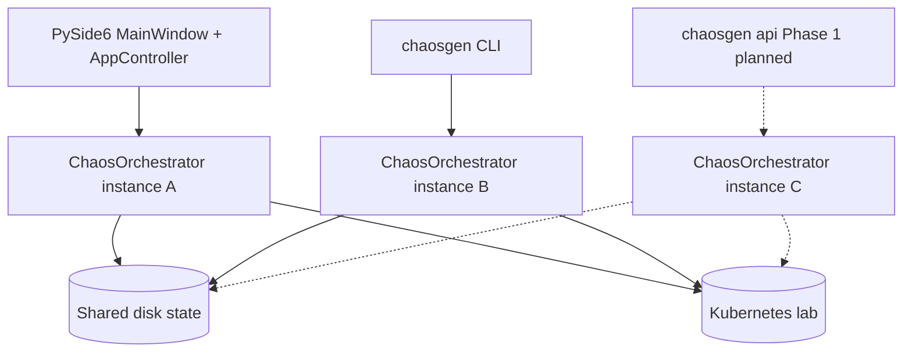
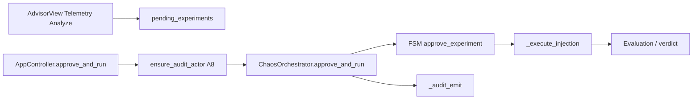
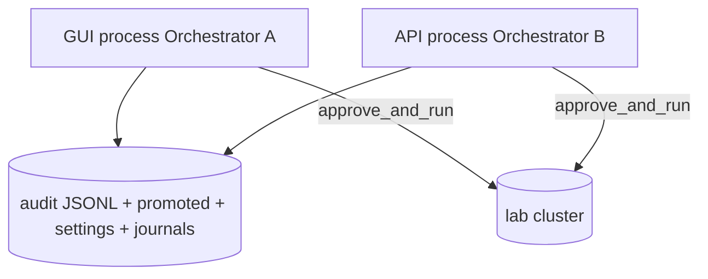

# ChaosGen current-state architecture map

**Branch:** `feat/api-layer-explore`  
**Purpose:** Phase 0 read-only map for thesis + outsource handoff + Phase 1 API design.  
**Method:** codebase-memory graph (`get_architecture`, `search_graph`, `trace_path`) + targeted source reads.  
**Coverage caveat:** hot paths reported `freshness: metadata_changed` at index time — structural claims are best-effort; re-verify before asserting completeness.

Base commit when this branch was cut: `e121794` (`fix(eval): lab-aware CTK fallback criteria for 1-replica boutique`).

---

## 1. Package responsibilities

| Package / module | Role |
|---|---|
| [`chaosgen/orchestrator.py`](../chaosgen/orchestrator.py) | Central FSM (`idle` → `pending_approval` → steady-state → inject → verify → rollback). Owns pending queue, CTK runs, HITL `approve_and_run`, audit emit hooks. |
| [`chaosgen/gui/`](../chaosgen/gui/) | PySide6 desktop UI. [`AppController`](../chaosgen/gui/controller.py) bridges Qt signals ↔ orchestrator; views under `gui/views/`. |
| [`chaosgen/cli.py`](../chaosgen/cli.py) | Second entrypoint to the same `ChaosOrchestrator` class (inject, promote, verdict, status, …). |
| [`chaosgen/config/`](../chaosgen/config/) | Settings (`%APPDATA%/chaosgen/settings.yaml`), secrets refs, telemetry URL resolution, paths. |
| [`chaosgen/advisor/`](../chaosgen/advisor/) | LLM/advisor pipeline, scenario catalog (builtin + promoted), promote/store, report persistence. |
| [`chaosgen/ml/`](../chaosgen/ml/) | Anomaly / gatekeeper / features (entity-keyed). |
| [`chaosgen/ingestion/`](../chaosgen/ingestion/) + [`telemetry/`](../chaosgen/telemetry/) | Prom/Loki clients, packs, collectors. |
| [`chaosgen/modules/`](../chaosgen/modules/) | Chaos backends (kubectl-chaos, CTK, pumba, …) behind `BaseChaosModule.execute`. |
| [`chaosgen/evaluation/`](../chaosgen/evaluation/) | CTK journal parse, expectation verdict, lab fallback criteria, alignment helpers. |
| [`chaosgen/storage/`](../chaosgen/storage/) | Audit JSONL, history SQLite, `atomic_io` (locks + append + `iter_jsonl`). |
| [`chaosgen/schemas/`](../chaosgen/schemas/) | Pydantic models shared across layers. |
| [`chaosgen/ucal/`](../chaosgen/ucal/) | Environment translator / validation. |
| [`chaosgen/discovery/`](../chaosgen/discovery/) | **Alive, not dead.** Hybrid discovery (`run_full_discovery`, `resolve_discovery_report`). Used by CLI `chaosgen discover`, `gui/analysis_pipeline`, `DiscoveryView`, `profile_presets`. Default lab mode sets `DISCOVERY_ENABLED=False` ([`config/scope.py`](../chaosgen/config/scope.py)) → form-first / focused report path; GUI Discovery nav is **hidden** but the package still runs for resolve/preset. |
| [`chaosgen/bootstrap/`](../chaosgen/bootstrap/) | **Alive, not dead.** `ObservabilityInstaller` + `ConnectionVerifier`. Called from CLI `chaosgen bootstrap` and `DiscoveryView` install path. Secondary to thesis demo (lab already has Prom/Loki) but still a supported entrypoint. |

Graph snapshot (indexed): ~3400 nodes / ~18600 edges; Python-dominant. High fan-in cores: `advisor`, `config`, `schemas`, `telemetry`.

---

## 2. Entrypoints today (and planned third)

- **GUI** and **CLI** each construct their own orchestrator — **FSM state is not shared across processes**.
- Phase 1 API is designed the same way: third process, own orchestrator, same on-disk artifacts.

---

## 3. Primary operator call chain (HITL)

Critical honesty points already hardened on `main`:

| Concern | Location | Behaviour |
|---|---|---|
| Operator identity | `AppController.ensure_audit_actor` → `resolve_actor` | Blocks inject without `operator_name` (A8) |
| Approve toast | `experiment_finish_payload` + `_emit_experiment_finished` | Uses `last_outcome`, not hardcoded PASS |
| Idle re-queue | `approve_and_run` | Re-enters `pending_approval` from `idle` when queue remains |
| Lab Evaluation SLA | `evaluation/fallback_criteria.py` | Lab Prom URL / settings → boutique threshold≥1, not demo ≥2 |

---

## 4. Coupling inventory (hot spots)

Re-verified **2026-09-11** via source/Grep after codebase-memory MCP was unavailable for `index_repository` (connection closed). Claims below match live call sites on this branch tip.

| Coupling | From → To | Evidence (re-check) | Risk if broken |
|---|---|---|---|
| HITL approve | GUI controller → `orchestrator.approve_and_run` | `AppController.approve_and_run` → `AsyncWorker(orchestrator.approve_and_run)`; also CLI promote path | False toast / missed audit |
| Audit actor | GUI A8 → `set_audit_context` → `_audit_emit` | `ensure_audit_actor` → `resolve_actor` → `set_audit_context` | Unattributable trail |
| Settings live reload | Settings / controller → `reload_cg_settings` | `AppController` calls `orchestrator.reload_cg_settings` after settings save | Stale `chaos_backend` / Prom URL |
| CTK Evaluation | `run_ctk_experiment` → `_evaluate_ctk_run` → fallback criteria | `orchestrator.py` ~511 / `_evaluate_ctk_run` + `evaluation/fallback_criteria.py` | False FAIL/PASS on SLA |
| Module inject | Orchestrator → `kubectl_chaos` / CTK modules | `_execute_injection` / `run_ctk_experiment` | Wrong backend (Mesh 404 vs delete_pod) |
| Catalog promote | Advisor / CLI → `PromotedStore` + catalog | `promoted_store.py` + CLI `promote` | Corrupt/lost Unknown→Known |
| Verdict UI | Evaluation view ← `%APPDATA%/chaosgen/last_verdict.json` | `report_store.LAST_VERDICT_FILE` | Stale stakeholder copy |

---

## 5. Shared on-disk state vs in-memory FSM (concurrency)

### In-memory (per process — NOT shared)

- `ChaosOrchestrator` FSM `state`
- `pending_experiments` list / current experiment
- `_run_id`, `_injecting`, module runtime handles
- Qt signal graph (GUI only)

### On-disk (shared if two processes use same machine/user)

| Artifact | Path (Windows thesis lab) | Writer lock? |
|---|---|---|
| Settings | `%APPDATA%/chaosgen/settings.yaml` | File rewrite via `save_settings` — **no cross-process mutex** documented |
| Secrets refs | `%APPDATA%/chaosgen/.env` | Local file |
| Audit JSONL | `%APPDATA%/chaosgen/audit_events.jsonl` (or `CHAOSGEN_AUDIT_LOG`) | **Yes** — `append_jsonl_line` + `ExclusiveFileLock` |
| Audit reader | same | **`iter_jsonl`** skips corrupt trailing line (A9) |
| Promoted catalog | `%APPDATA%/chaosgen/promoted_scenarios.json` (+ `.lock`) | **Yes** — `ExclusiveFileLock` on write |
| Last verdict | `%APPDATA%/chaosgen/last_verdict.json` | Whole-file write; last writer wins |
| CTK journals / experiments | repo `scratch/ctk/` | Filesystem races possible if dual writers |
| History SQLite | settings `history.db_path` / default under config | SQLite locking (separate concern) |

### Dual-inject honesty (Phase 1 limit)

**Claim we do NOT make:** “API and GUI cannot both inject.”

**Evidence:** Each process has its own FSM. Nothing in-process checks “is another ChaosGen process injecting?” Cluster mutations (pod delete, CTK run) can proceed from both.

**What locks do provide:** safer concurrent **append/read** of audit JSONL and promoted catalog writers — not mutual exclusion of HITL inject.

**Phase 1 policy:** operational rule — do not run `chaosgen api` mutating routes while GUI HITL is active (and vice versa). Document again in merge-gate and demo-day checklist. Cross-process inject mutex is **Phase 2+ / out of scope** unless explicitly escalated.

### In-process API concurrency (Phase 1)

- One `ChaosOrchestrator` per `chaosgen api` process, shared across HTTP requests.
- Mutating routes serialize on a process-scoped `threading.Lock` (critical section includes `set_audit_context` + orch call).
- `_consumed_approvals` blocks re-approve of the same experiment **name** in one AI queue; pre-inject FAIL releases the token via `_abort_steady_state`.

---

## 6. Is the architecture “fragmented”?

**Verdict: partially real debt, partially perception from evidence-driven growth.**

| Observation | Interpretation |
|---|---|
| Many small modules under `chaosgen/` | Normal for a thesis product evolved by “bug → patch with JSON evidence” |
| Clear ownership domains (advisor / ml / modules / evaluation / storage) | **Not** spaghetti — packages have roles |
| `orchestrator.py` is a large God-object FSM | **Real** concentration of coupling — primary Phase 2 tidy candidate |
| Duplicate-ish advisors (`advisor/llm_advisor.py` vs `ml/llm_advisor.py`) | Historical layering — worth consolidating later, not now |
| GUI + CLI + (future) API each new entrypoint | Expected hexagonal growth; danger is shared disk + dual inject, not “too many folders” |
| Scratch rehearsal scripts | Ops evidence, not runtime architecture — keep out of “core” narrative |

For thesis: describe as **modular monolith with a central orchestrator FSM and adapter modules**, plus honest note that orchestrator concentration and multi-entrypoint disk sharing are known limits.

---

## 7. Implications for Phase 1 FastAPI

- Wrap **public** orchestrator methods; do not refactor FSM (except surgical `_consumed_approvals` / `_abort_steady_state`).
- Mutating routes require `X-Operator-Name` → `set_audit_context` (mirror A8) with `path_used=api_hitl`.
- Audit/verdict reads must reuse `AuditStore` / `iter_jsonl` / `load_verdict_report` — no new JSONL parser.
- Treat dual-inject as **operational limit**; in-process mutating lock + anti-reapprove are mandatory.
- Prefer tests that keep `chaosgen/api` inside coverage floor before merge to `main`.

---

## 8. Index coverage / re-verify note

- Phase 0 map used codebase-memory; later MCP binary was missing and was reinstalled (`codebase-memory-mcp` 0.10.8).
- **Re-index (2026-09-12):** project `H-Project-AIO-Chaos-Tool` — **3441 nodes / 18638 edges**, status ready. Coupling inventory (section 4) re-verified against that index; `parse_partial` Jinja/nginx/Dockerfile ranges do not affect Python HITL graph claims.
- Phase 1 API scaffold proceeds with graph + source evidence for `approve_and_run` / anti-reapprove.
