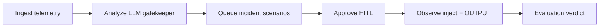

# ChaosGen web UI layout blueprint (Phase 0)

**Status:** Wireframe / information architecture only. **No frontend framework chosen.**  
**Stack decision:** deferred to a separate Phase 2 Plan after thesis defense (self-hosted SPA preferred over Electron).  
**Inspiration:** [VersusControl/versus-incident](https://github.com/VersusControl/versus-incident) ops flow (signal → incident → action → history), not a code fork.  
**Skills applied:** `frontend-design` (named aesthetic), `ui-ux-pro-max` (nav/density/a11y), `web-design-guidelines`.  
**PySide6:** remains supported; this blueprint describes an **additive** web surface consuming Phase 1 `/v1/*` later.

---

## 1. Aesthetic direction (named)

**Industrial utilitarian ops console** — dense, calm, evidence-first.

- Dark graphite surfaces, sharp type hierarchy, minimal chrome.
- Status color reserved for outcomes only: PASS / FAIL / PARTIAL / PENDING (no decorative purple gradients).
- Memorable element: a persistent **Run honesty strip** (FSM state + last toast outcome + operator name) always visible — mirrors what the thesis cares about.
- Avoid: generic AI-dashboard purple, floating badge clutter, oversized hero marketing layouts.

DFII (self-score): Impact 4, Fit 5, Feasibility 4, Performance 4, Consistency risk 2 → strong fit for a restrained ops product.

---

## 2. Sitemap — PySide6 today → web routes later

Current nav groups ([`gui/main.py`](../chaosgen/gui/main.py)): **Advise → Run → Review** (+ Settings).

| Web route (proposed) | PySide6 view | Primary job |
|---|---|---|
| `/` | Dashboard | At-a-glance FSM + module health |
| `/telemetry` | AdvisorView (Telemetry) | Ingest / Analyze / anomalies |
| `/catalog` | ScenarioCatalogView | Browse builtin + promoted; queue |
| `/experiments` | ExperimentsView | Targets, create/CTK, history, HALT |
| `/modules` | ModulesView | Backend module status / actions |
| `/evaluation` | EvaluationView | Stakeholder verdict / improve notes |
| `/settings` | SettingsView | Observability, inject, operator |
| `/audit` *(web-only enhancement)* | (OUTPUT + audit file) | First-class incident/audit timeline |

Discovery view exists but is hidden for microservices-only scope — keep optional `/discovery` out of v1 web IA.

---

## 3. Primary operator flow (Versus-shaped)



Versus mapping:

| Versus | ChaosGen |
|---|---|
| Learn / detect signal | Telemetry + anomaly + gatekeeper |
| Open incident | Pending AI / catalog scenario |
| Ack / act | Approve (+ A8 operator) |
| Notify / history | Audit JSONL + Evaluation + History list |

**Training-mode analogue:** Analyze + queue without Approve; dry-run CTK; rehearsal scripts under `scratch/prom-loki-fit/`.

---

## 4. Global chrome (every page)

```
+------------------------------------------------------------------+
| ChaosGen  | Advise | Run | Review |          operator | settings |
+------------------------------------------------------------------+
| HONESTY STRIP: FSM=… | last_outcome=… | modules=N | api=off/on  |
+------------------------------------------------------------------+
| SIDEBAR / CONTEXT          | MAIN WORK SURFACE                    |
|                            |                                      |
+------------------------------------------------------------------+
| OUTPUT / EVENT STREAM (collapsible) — structured logs + audit tail|
+------------------------------------------------------------------+
```

Rules:

- Honesty strip is never decorative — it must match orchestrator/`last_outcome` semantics (no second toast language).
- OUTPUT stays subordinate to the main task (one job per section).
- When `chaosgen api` is detectable locally, show `api=on` warning if GUI also active (soft cue for dual-inject rule).

---

## 5. Page wireframes (blocks only)

### `/telemetry`
- Ingest mode / pack selector
- Connect readiness (Prom/Loki)
- Analyze CTA
- Top signals / anomaly list
- “Send to queue” actions → pending

**Later APIs:** status, telemetry readiness (Phase 1 thin), pending list.

### `/catalog`
- Filters: architecture / fault / source / search
- List + detail
- Add to approval queue
- Promoted-only edit/delete (same safety as today)

**Later APIs:** pending after queue; no Mesh-happy-path marketing on lab.

### `/experiments`
- Lifecycle tabs: Pending / Injecting / Running / Finished
- History list (**known live PySide6 bug — not fixed on main:** orphan `[STARTED]` rows; see [`phase2-backlog.md`](phase2-backlog.md). Web should model **run_id** and must not pretend the desktop bug is already gone)
- Target + fault composer
- HALT / Open Evaluation
- Preview experiment JSON

**Later APIs:** `GET/POST /v1/pending*`, `POST /v1/halt`, status.

### `/evaluation`
- Headline: PASS / FAIL / PARTIAL (stakeholder language)
- Claim + rationale
- Checks table
- Where to improve
- Refresh from `last_verdict.json`

**Later APIs:** `GET /v1/verdict/last`.

### `/audit` (web-first)
- Chronological audit events (`iter_jsonl`)
- Filter by run_id / event_type / actor
- Deep link from Approve

**Later APIs:** `GET /v1/audit/recent`.

### `/settings`
- Observability URLs, inject backend, operator_name, evaluation.fallback_criteria_path
- Save → must document reload semantics (GUI `reload_cg_settings`; API process may need restart)

---

## 6. Phase 1 API consumption map

| UI need | Phase 1 endpoint |
|---|---|
| Liveness | `GET /health` |
| FSM + modules | `GET /v1/status` |
| Queue | `GET /v1/pending` |
| Approve | `POST /v1/pending/{index}/approve` + `X-Operator-Name` |
| Reject | `POST /v1/pending/reject-all` |
| Halt | `POST /v1/halt` |
| Audit trail | `GET /v1/audit/recent` |
| Verdict | `GET /v1/verdict/last` |

Web UI must not invent stronger claims than these payloads (`ran` / `outcome` / `reason`).

---

## 7. Accessibility / UX checklist (from ui-ux-pro-max)

- Contrast ≥ 4.5:1 for body text on graphite
- Visible focus rings on Approve / HALT
- Do not rely on color alone for PASS/FAIL (include text badge)
- Keyboard path for Approve/Reject
- Dense tables OK; avoid hover-only critical actions

---

## 8. Non-goals of this blueprint

- No React/Vue/Svelte choice
- No Electron packaging decision
- No visual mock PNG required for Phase 0 exit
- No replacement of PySide6 in v1.0 thesis path
