# ChaosGen (AIO-Chaos-Tool) — IT Project Proposal

> **Tài liệu:** Đề xuất dự án kỹ thuật (Technical Project Proposal)  
> **Phiên bản:** 0.2.0 (theo `setup.py`)  
> **Đối tượng:** Hội đồng bảo vệ / Technical Review Board  
> **Góc nhìn:** Kỹ sư phần mềm — ưu tiên kiến trúc, luồng dữ liệu, đặc tả kỹ thuật và yêu cầu phi chức năng

---

## Executive Summary

**ChaosGen** là nền tảng **AI-Driven Chaos Engineering** tự động hóa vòng đời thử nghiệm hỗn loạn (chaos): **khám phá hệ thống → sinh kịch bản → phê duyệt con người (HITL) → thực thi an toàn → đánh giá bằng telemetry**. Dự án không phải một SaaS microservices truyền thống mà là **control plane dạng CLI/Desktop** tích hợp sáu công cụ chaos bên thứ ba và stack observability (Prometheus, Loki, Grafana, Jaeger).

| Khía cạnh | Quyết định thiết kế |
|-----------|---------------------|
| **Kiến trúc tổng thể** | Pipeline-oriented monolith (Python package `chaosgen`) với separation of concerns theo domain |
| **Entry surfaces** | CLI (`click`) + GUI (`PySide6`) |
| **Trạng thái & hợp đồng dữ liệu** | Pydantic v2 schemas + YAML/JSON artifacts |
| **Điều phối thí nghiệm** | State machine (`transitions`) + Human-in-the-Loop gate |
| **Tích hợp chaos** | Universal Chaos Abstraction Layer (UCAL) + 6 module adapters |
| **AI/ML** | Multi-provider LLM + IsolationForest/KMeans anomaly detection |

---

## Mục lục

1. [Tổng quan kiến trúc hệ thống](#1-tổng-quan-kiến-trúc-hệ-thống)
2. [Pipeline dữ liệu & luồng xử lý](#2-pipeline-dữ-liệu--luồng-xử-lý)
3. [Thiết kế dữ liệu & lưu trữ](#3-thiết-kế-dữ-liệu--lưu-trữ)
4. [Tầng giao tiếp & đặc tả API](#4-tầng-giao-tiếp--đặc-tả-api)
5. [Infrastructure & DevOps](#5-infrastructure--devops)
6. [Ma trận chất lượng: bảo mật & hiệu năng](#6-ma-trận-chất-lượng-bảo-mật--hiệu-năng)
7. [Kế hoạch phát triển & cột mốc](#7-kế-hoạch-phát-triển--cột-mốc)
8. [Rủi ro kỹ thuật & phương án dự phòng](#8-rủi-ro-kỹ-thuật--phương-án-dự-phòng)
9. [Phụ lục](#phụ-lục)

---

## 1. Tổng quan kiến trúc hệ thống

### 1.1 High-Level Architecture

ChaosGen đóng vai trò **orchestrator/control plane** đứng giữa người vận hành và hạ tầng mục tiêu. Không có API Gateway HTTP nội bộ; giao tiếp chính là **CLI/GUI → Python services → external APIs** (K8s, Docker, Prometheus, LLM).

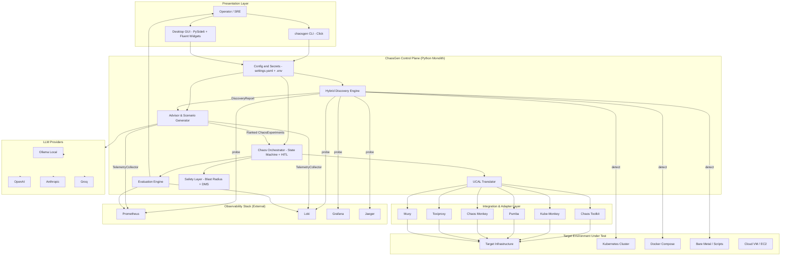

### 1.2 Phân tầng trách nhiệm (Separation of Concerns)

| Tầng | Thành phần | Công nghệ | Lý do lựa chọn |
|------|------------|-----------|----------------|
| **Presentation** | CLI, GUI views | Click, PySide6 | CLI cho CI/automation; GUI cho operator review HITL và trực quan hóa discovery |
| **Application / Domain** | `discovery/`, `advisor/`, `orchestrator.py`, `evaluation/` | Python 3.10+, Pydantic | Type-safe contracts; dễ test; ecosystem ML/LLM mạnh |
| **Integration** | `modules/*`, `ucal/`, `ingestion/` | Adapter pattern | Che giấu sự khác biệt giữa 6 chaos tools |
| **Configuration** | `config/settings.py`, `config/secrets.py` | YAML + dotenv | Không hard-code secrets; XDG/APPDATA paths |
| **External data plane** | Prometheus, Loki, K8s API | HTTP/REST, client libs | Chuẩn industry cho observability & orchestration |

### 1.3 Cấu trúc package (Logical Components)

```
chaosgen/
├── cli.py                 # Entry: discover | bootstrap | generate | run | evaluate | status | config
├── orchestrator.py        # State machine + HITL + module dispatch
├── discovery/             # EnvironmentProbe, ServiceMapper, ArchitectureClassifier, ObservabilityProbers
├── bootstrap/             # ObservabilityInstaller (K8s Helm / Docker Compose / scripts)
├── advisor/               # ContextBuilder, LLMAdvisor, ScenarioGenerator, ScenarioRanker, ScenarioCatalog
├── ml/                    # FeatureEngineer, AnomalyDetector (sklearn)
├── ingestion/             # TelemetryCollector → Prometheus + Loki clients
├── modules/               # 6 chaos tool adapters (BaseChaosModule)
├── schemas/               # Pydantic: DiscoveryReport, ChaosExperiment, AdvisorReport, ...
├── safety/                # BlastRadiusController, DeadMansSwitch, SafetyPolicy
├── evaluation/            # KPITracker, ABComparator
├── ucal/                  # ChaosTranslator, SteadyStateValidator
└── gui/                   # PySide6 views mirroring CLI flows
```

### 1.4 Nguyên tắc kiến trúc phần mềm

| Nguyên tắc | Áp dụng trong ChaosGen |
|------------|------------------------|
| **Pipeline-oriented design** | Mỗi lệnh CLI tương ứng một pipeline có input/output schema rõ ràng |
| **Schema-first contracts** | Pydantic models là single source of truth cho discovery, experiments, reports |
| **Adapter pattern** | `BaseChaosModule` + `MODULE_REGISTRY` — thêm tool mới không sửa orchestrator core |
| **Fail-safe execution** | State machine + blast radius + dead man's switch trước khi inject |
| **Explicit uncertainty** | `DiscoverySignal` ghi nhận mismatch, auth failure — không che lỗi probe |
| **HITL by design** | AI chỉ đề xuất; con người approve trước `steady_state_check` |

### 1.5 Khả năng mở rộng (Scalability)

| Chiều | Hiện trạng | Hướng mở rộng |
|-------|------------|---------------|
| **Horizontal (control plane)** | Single-process CLI/GUI | Tách REST/gRPC API + job queue cho multi-tenant |
| **Target environments** | K8s, Docker, bare metal, cloud VM | Thêm serverless probes, Terraform state reader |
| **Chaos tools** | 6 adapters | Đăng ký module mới qua `MODULE_REGISTRY` |
| **LLM providers** | Ollama, OpenAI, Anthropic, Groq | `build_provider()` factory pattern |
| **Telemetry volume** | Pull-based Prometheus/Loki queries | Streaming aggregation, downsampling |

---

## 2. Pipeline dữ liệu & luồng xử lý

### 2.1 Data Flow Diagram (DFD) — Cấp 0

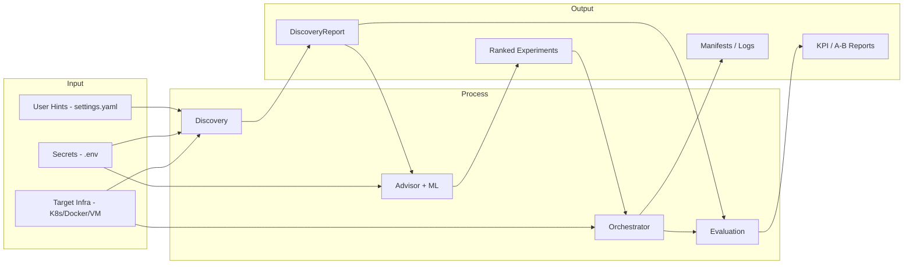

### 2.2 Vòng đời nghiệp vụ cốt lõi (Core Loop)

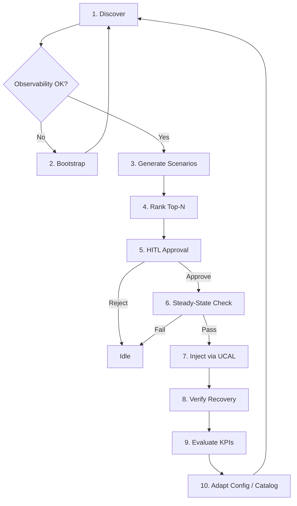

### 2.3 Sequence Diagram — Hybrid Discovery

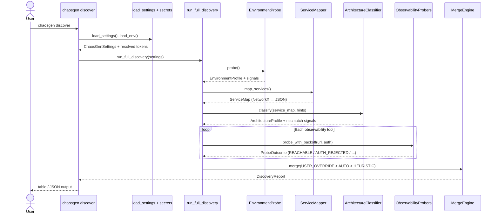

**Quy tắc merge ưu tiên:** `USER_OVERRIDE` > `AUTO_DETECTED` > `HEURISTIC_FALLBACK`. Mọi xung đột được ghi thành `DiscoverySignal` (ví dụ `USER_HEURISTIC_MISMATCH`).

### 2.4 Sequence Diagram — AI Scenario Generation + HITL

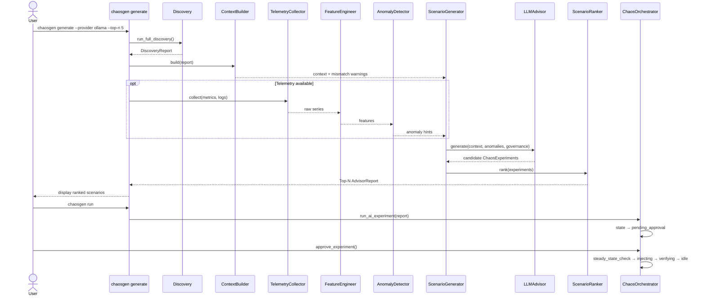

**Nhánh thay thế (không LLM):** `chaosgen generate --from-catalog --arch microservices` → `ScenarioCatalog` trả về experiments deterministic, không gọi LLM.

### 2.5 State Machine — Chaos Orchestrator

Trạng thái được implement bằng thư viện `transitions` trong `chaosgen/orchestrator.py`.

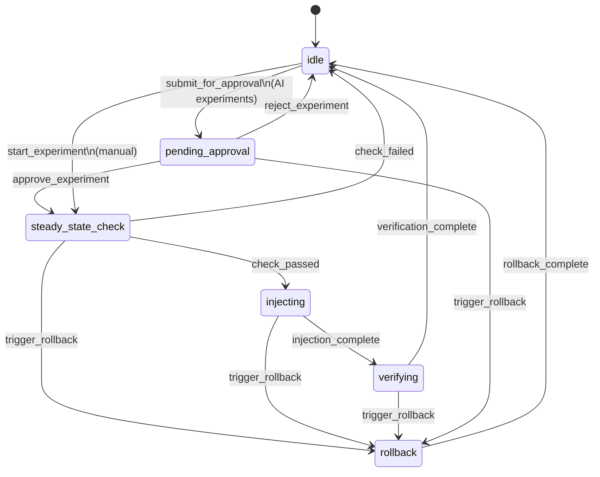

| Transition | Điều kiện / Side effect |
|------------|-------------------------|
| `approve_experiment` | Operator xác nhận blast radius & target |
| `check_passed` | `BlastRadiusController.validate()` + `SteadyStateValidator` OK |
| `check_failed` | Vi phạm `SafetyPolicy` hoặc baseline unhealthy |
| `trigger_rollback` | Dead Man's Switch phát hiện vi phạm steady-state |
| `_execute_injection` | `ChaosTranslator.translate()` → `execute_action()` per module |

### 2.6 Sequence Diagram — Experiment Execution với Safety

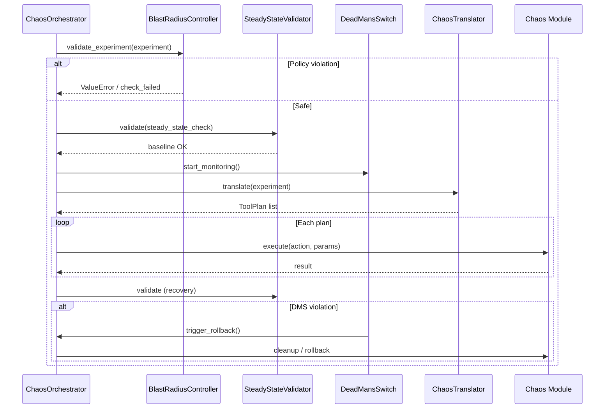

---

## 3. Thiết kế dữ liệu & lưu trữ

### 3.1 Đặc điểm lưu trữ

ChaosGen **không sử dụng RDBMS nội bộ**. Mô hình dữ liệu là:

| Loại | Vị trí | Mục đích |
|------|--------|----------|
| **Cấu hình** | `$XDG_CONFIG_HOME/chaosgen/settings.yaml` (Linux) / `%APPDATA%\chaosgen\` (Windows) | Hints, LLM provider, observability endpoints |
| **Secrets** | `.env` (chmod 600 trên Unix) | API keys, bearer tokens (reference-by-name) |
| **Experiments** | YAML/JSON manifests (`manifest_writer`) | Export/import kịch bản |
| **Runtime state** | In-memory (`ChaosOrchestrator`, GUI controller) | State machine, pending queue |
| **Telemetry** | External Prometheus/Loki | Time-series metrics & logs (không persist local) |
| **Service topology** | `ServiceMap.node_link_data` (NetworkX serialization) | LLM context + GUI graph |

### 3.2 Logical ERD (Mô hình thực thể logic)

Quan hệ dưới đây mô tả **domain model Pydantic**, chuẩn hóa đến mức 3NF ở tầng logic (không map 1:1 sang bảng SQL).

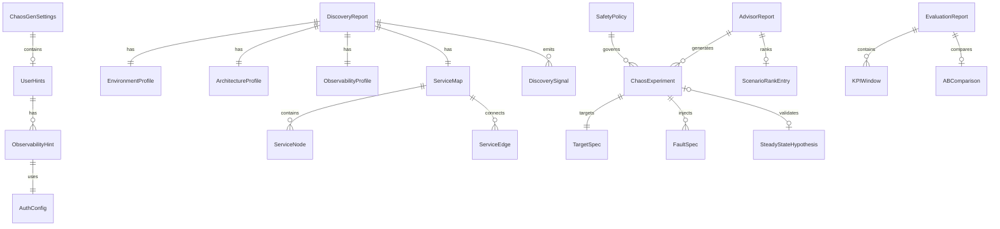

### 3.3 Đặc tả thực thể chính

#### EnvironmentProfile

| Thuộc tính | Kiểu | Mô tả |
|------------|------|-------|
| `type` | `EnvironmentType` enum | `kubernetes`, `docker_compose`, `bare_metal`, `cloud_vm`, `serverless` |
| `runtime_version` | string? | Phiên bản K8s/Docker |
| `node_count` | int? | Số node (K8s) |
| `cloud_provider` | string? | `aws` / `gcp` / `azure` |
| `has_service_mesh` | bool | Istio/Linkerd detected |

#### ChaosExperiment (hợp đồng thí nghiệm)

| Thuộc tính | Kiểu | Mô tả |
|------------|------|-------|
| `name` | string | Định danh thí nghiệm |
| `target` | `TargetSpec` | `type`, `name`, `namespace`, `selector` |
| `faults` | `List[FaultSpec]` | `network_latency`, `process_kill`, `resource_exhaustion`, ... |
| `steady_state_check` | dict? | Hypothesis kiểm tra sức khỏe hệ thống |
| `rollback` | bool | Tự động rollback (default: true) |

#### DiscoverySignal (audit trail)

| Field | Ý nghĩa |
|-------|---------|
| `source` | `USER_OVERRIDE` / `AUTO_DETECTED` / `HEURISTIC_FALLBACK` |
| `key` | Ví dụ `architecture.type`, `observability.prometheus` |
| `confidence` | 0.0 – 1.0 |
| `flag` | `USER_HEURISTIC_MISMATCH`, `AUTH_REJECTED`, ... |

### 3.4 Service Map — Embedding vs Referencing

| Chiến lược | Áp dụng |
|------------|---------|
| **Structured lists** | `nodes[]`, `edges[]` — dùng cho GUI và ScenarioRanker |
| **Embedded graph JSON** | `node_link_data` — export NetworkX cho LLM context (một document self-contained) |
| **Không reference DB** | Graph được rebuild mỗi lần `discover` |

### 3.5 Object / Artifact Storage

| Artifact | Định dạng | Sinh bởi |
|----------|-----------|----------|
| Bootstrap manifests | YAML, shell, Terraform | `ObservabilityInstaller` |
| Experiment exports | YAML/JSON | `manifest_writer` |
| Evaluation exports | CSV/JSON | `chaosgen evaluate --export` |
| Docker dev image | OCI image | `Dockerfile` multi-layer cache |

---

## 4. Tầng giao tiếp & đặc tả API

### 4.1 Giao thức truyền thông

| Giao thức | Vai trò | Công nghệ |
|-----------|---------|-----------|
| **CLI contract** | Giao tiếp đồng bộ chính với operator | Click command groups |
| **HTTP/REST** | Probe observability, LLM cloud APIs | `requests`, OpenAI/Anthropic SDK |
| **K8s API** | Discovery, bootstrap Helm/kubectl | `kubernetes` Python client |
| **Subprocess** | Chaos Toolkit, Pumba CLI, kubectl | `subprocess` |
| **Structured output** | Machine-readable integration | JSON (`--output json`), Pydantic `model_dump_json()` |

> **Lưu ý cho hội đồng:** REST API server **chưa triển khai** — nằm trong roadmap mở rộng. Hiện tại contract công khai là **CLI + file schemas**.

### 4.2 CLI API Contract (Core Endpoints)

| Command | Input | Output | Mô tả |
|---------|-------|--------|-------|
| `chaosgen discover` | `settings.yaml`, optional `--arch`, `--env` | `DiscoveryReport` (table/JSON) | Hybrid discovery |
| `chaosgen bootstrap` | `--tier k8s\|docker\|script` | Install actions / generated artifacts | Observability bootstrap |
| `chaosgen generate` | `--provider`, `--top-n`, `--from-catalog` | Ranked `ChaosExperiment[]` | AI hoặc catalog |
| `chaosgen run` | Approved experiments | Orchestrator state transitions | HITL execution |
| `chaosgen evaluate` | Time windows | KPI + A/B report | Post-experiment analysis |
| `chaosgen status` | — | Module health map | Adapter introspection |
| `chaosgen config` | `init`, `set-key` | `settings.yaml`, `.env` | Configuration management |

### 4.3 Request/Response mẫu

#### Discovery — JSON output

```json
{
  "environment": {
    "type": "kubernetes",
    "runtime_version": "1.29.0",
    "node_count": 3,
    "has_service_mesh": false
  },
  "architecture": {
    "type": "microservices",
    "service_count": 12,
    "confidence": 0.87,
    "signals": ["Detected API gateway", "12 Deployments with inter-service HTTP"]
  },
  "observability": {
    "has_metrics": true,
    "metrics_endpoint": "http://prometheus:9090",
    "has_logs": true,
    "logs_endpoint": "http://loki:3100",
    "missing": []
  },
  "signals": [
    {
      "source": "AUTO_DETECTED",
      "key": "observability.prometheus",
      "value": "REACHABLE",
      "confidence": 1.0,
      "message": "Prometheus /api/v1/status/buildinfo OK"
    }
  ]
}
```

#### ChaosExperiment — YAML manifest

```yaml
name: api-latency-spike-100ms
description: Inject 100ms latency on api-service via Toxiproxy
target:
  type: service
  name: api-service
  namespace: staging
faults:
  - fault_type: network_latency
    duration: 60s
    latency: 100ms
    jitter: 10ms
steady_state_check:
  type: prometheus
  query: 'rate(http_requests_total{status=~"5.."}[1m])'
  tolerance: 0.05
rollback: true
```

#### Advisor ranking metadata (conceptual)

```json
{
  "experiment_name": "redis-connection-timeout",
  "score": 0.82,
  "dimensions": {
    "impact": 0.9,
    "safety_margin": 0.75,
    "observability_coverage": 0.85,
    "learning_value": 0.78
  }
}
```

### 4.4 Universal Chaos Abstraction Layer (UCAL)

| Thành phần | Trách nhiệm |
|------------|-------------|
| `ChaosTranslator` | `ChaosExperiment` → `ToolPlan(tool, action, params)` |
| `SteadyStateValidator` | Đánh giá hypothesis trước/sau injection |
| `ExecutionEnvironment` | Map environment type → module capabilities |

**Ví dụ mapping:**

| Fault (abstract) | Tool | Action |
|------------------|------|--------|
| `network_latency` | `toxiproxy` | `add_latency` |
| `process_kill` | `pumba` | `kill` |
| `pod_failure` | `kube-monkey` | `schedule_kill` |
| Declarative experiment | `chaos-toolkit` | `run_experiment` |

### 4.5 Module Adapter Interface (Internal API)

```python
class BaseChaosModule:
    def execute(self, action: str, params: Dict[str, Any]) -> Dict[str, Any]: ...
    def get_status(self) -> Dict[str, Any]: ...
    def list_actions(self) -> List[str]: ...
```

Mọi module trong `MODULE_REGISTRY` tuân thủ contract này — đảm bảo orchestrator không phụ thuộc implementation cụ thể.

---

## 5. Infrastructure & DevOps

### 5.1 Containerization

**Dockerfile** (`python:3.12-slim`):

| Kỹ thuật | Mục đích |
|----------|----------|
| Layer caching (`requirements.txt` trước source) | Giảm thời gian rebuild CI |
| BuildKit pip cache mount | Tăng tốc `pip install` |
| `pip install -e ".[dev]"` | Editable install cho dev container |
| `PYTHONDONTWRITEBYTECODE=1` | Image sạch hơn |

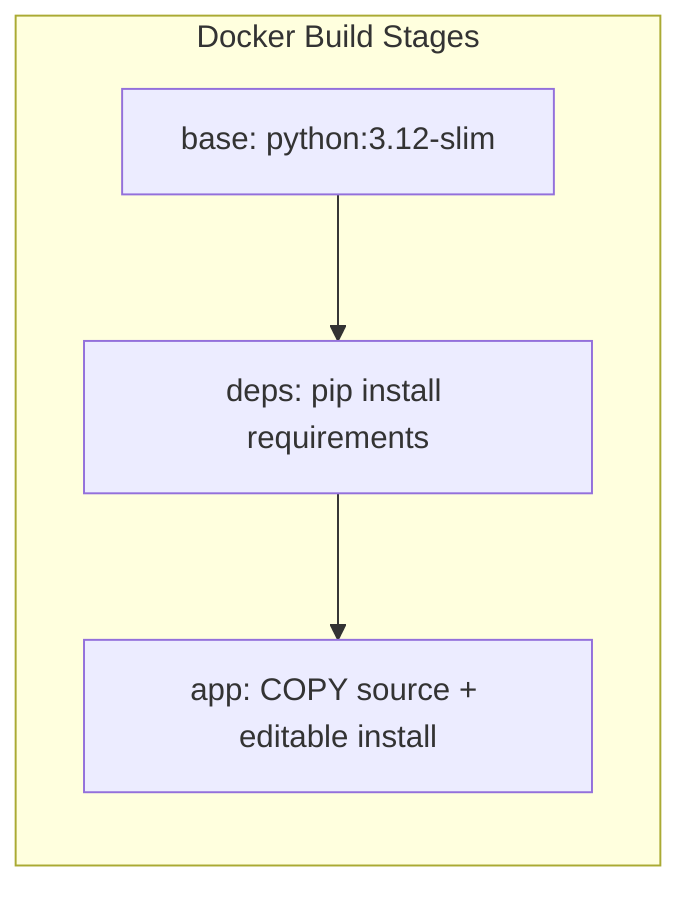

### 5.2 Local orchestration

`docker-compose.yml` cung cấp profile `dev` với volume mount `./:/app` cho pytest trong container.

### 5.3 CI/CD — Hiện trạng & Đề xuất

| Giai đoạn | Hiện trạng | Đề xuất triển khai |
|-----------|------------|-------------------|
| Lint | Manual | `ruff` + `mypy` trong GitHub Actions |
| Unit test | `pytest` (local/Docker) | CI matrix Python 3.10–3.12 |
| Integration | `tests/environments/*` | K3s kind cluster job (optional) |
| Security scan | — | `pip-audit`, `bandit` |
| Release | Manual `pip install -e` | Tag → PyPI / GitHub Release artifact |
| Deploy demo | Docker Compose trên VPS | Staging environment cho hội đồng demo |

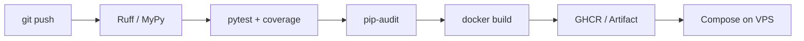

### 5.4 Môi trường triển khai đề xuất

| Môi trường | Mục đích | Stack |
|------------|----------|-------|
| **Local** | Development | Python venv + optional Docker |
| **CI** | Automated test | GitHub Actions + Docker |
| **Staging** | Pre-demo chaos runs | K3s hoặc Docker Compose + kube-prometheus-stack |
| **Demo fallback** | Bảo vệ đồ án | Single VPS + Docker Compose thuần |

---

## 6. Ma trận chất lượng: bảo mật & hiệu năng

### 6.1 Security Strategy

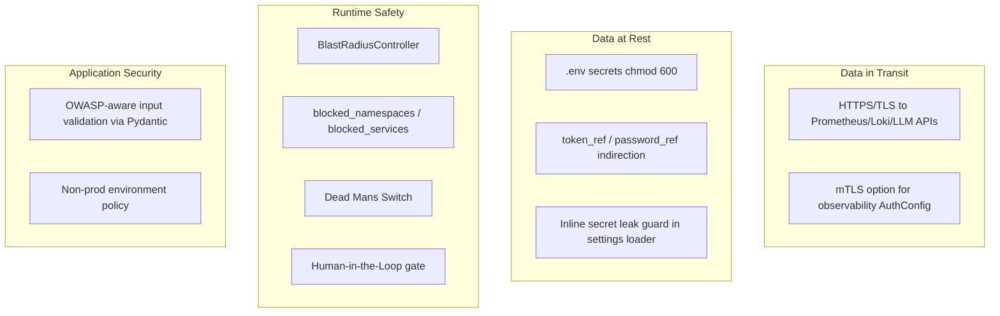

| Mối đe dọa (OWASP-aligned) | Biện pháp trong ChaosGen |
|-----------------------------|--------------------------|
| **Broken Authentication** | Auth probe phân loại `AUTH_REJECTED`; không retry vô ích |
| **Sensitive Data Exposure** | Secrets chỉ trong `.env`; `token_ref` không chứa raw secret trong YAML |
| **Injection** | Pydantic validation; parameterized subprocess where applicable |
| **SSRF (probe)** | URL từ user config — cần network policy khi deploy shared |
| **Unsafe chaos blast** | `SafetyPolicy`: max pods %, blocked namespaces |

### 6.2 Safety Policy (mặc định)

```yaml
global:
  safety:
    max_blast_radius_pods_pct: 20
    blocked_namespaces:
      - kube-system
      - monitoring
```

Implement trong `chaosgen/safety/governance.py` — `BlastRadiusController.validate_experiment()`.

### 6.3 Monitoring & Logging

| Thành phần | Cơ chế |
|------------|--------|
| **Application logs** | Python `logging` — `ChaosOrchestrator`, modules |
| **Target metrics** | Pull từ Prometheus (latency, error rate, saturation) |
| **Target logs** | Pull từ Loki |
| **Đề xuất production** | Export logs → Loki; dashboards Grafana cho experiment windows |

### 6.4 Performance & Load Testing Plan

| Metric | Target đề xuất | Công cụ |
|--------|----------------|---------|
| Discovery latency | < 30s (K8s cluster vừa) | Benchmark script |
| LLM generation | < 120s cho top-5 (Ollama 3B local) | Timer trong CLI |
| Orchestrator overhead | < 500ms excluding tool execution | Unit benchmarks |
| Concurrent experiments | 1 active (by design — safety) | State machine guard |

**Công cụ:** `locust` (đã có trong `[dev]` extras) cho stress test API mục tiêu trong lúc chaos; `pytest-benchmark` cho micro-benchmarks nội bộ.

| Chỉ số | Mục tiêu demo |
|--------|---------------|
| p95 discovery | ≤ 45s |
| p99 LLM round-trip | ≤ 180s (local Ollama) |
| Rollback trigger latency | ≤ 10s sau steady-state violation |

---

## 7. Kế hoạch phát triển & cột mốc

### 7.1 Engineering Roadmap (16 tuần)

| Giai đoạn | Thời gian | Deliverables kỹ thuật | Trạng thái |
|-----------|-----------|----------------------|------------|
| **G1: Nghiên cứu & Thiết kế** | Tuần 1–3 | SRS, architecture doc, Pydantic schemas, package scaffold | ✅ Hoàn thành |
| **G2: Discovery & Bootstrap** | Tuần 4–6 | `run_full_discovery`, observability probers, `ObservabilityInstaller`, unit tests | ✅ Hoàn thành |
| **G3: Advisor & ML** | Tuần 7–9 | Multi-LLM advisor, `ScenarioRanker`, `AnomalyDetector`, scenario catalog | ✅ Hoàn thành |
| **G4: Orchestrator & Safety** | Tuần 10–11 | State machine, HITL, UCAL, 6 module adapters, blast radius + DMS | ✅ Hoàn thành |
| **G5: GUI & Evaluation** | Tuần 12–13 | PySide6 views, `KPITracker`, `ABComparator` | ✅ Hoàn thành |
| **G6: Hardening & Báo cáo** | Tuần 14–16 | CI/CD, load test report, thesis, demo environment | 🔄 Đang thực hiện |

### 7.2 Backlog ưu tiên (Post-MVP)

| ID | Hạng mục | Giá trị |
|----|----------|---------|
| P1 | GitHub Actions CI (lint + test + coverage badge) | Chất lượng & minh chứng cho hội đồng |
| P2 | REST API wrapper cho orchestrator | Tích hợp pipeline CI/CD bên ngoài |
| P3 | Persistent experiment history (SQLite/Postgres) | Audit trail & regression analysis |
| P4 | OpenAPI spec + Swagger UI | Contract documentation chuẩn |
| P5 | WebSocket live status stream | Real-time GUI/portal |

### 7.3 Tiêu chí nghiệm thu (Definition of Done)

Giai đoạn **G6: Hardening & Báo cáo** — tick khi hoàn tất từng hạng mục.

| # | Tiêu chí | Deliverable / lệnh kiểm tra | Trạng thái |
|---|----------|----------------------------|------------|
| G6.1 | Unit & integration tests | `pytest tests/ --cov=chaosgen --cov-fail-under=70` | [x] |
| G6.2 | Demo E2E | `examples/demo-e2e.sh` — analyze/generate → incidents `--from-report` → HITL → promote → evaluate — [docs/e2e-demo.md](e2e-demo.md) | [x] |
| G6.3 | Tài liệu kiến trúc | [docs/IT_PROJECT_PROPOSAL.md](IT_PROJECT_PROPOSAL.md) (file này) + [docs/pipeline-framework.md](pipeline-framework.md) (Figures 1–2; advisor scan local/gitignored) | [x] docs framework |
| G6.4 | Load test | Network latency (`upstream-timeout-cascade`) — [docs/load-test-report.md](load-test-report.md) | [x] template + procedure |
| G6.5 | Demo artifacts | [docs/e2e-demo.md](e2e-demo.md) + screenshot checklist; video optional | [x] script + guide |

**Ghi chú G6.3:** Pipeline framework (Figure 1/2), module mapping, và advisor source
diagram đã có trong `docs/pipeline-framework.md`. Cập nhật Figure 2 (dashed → solid)
sau mỗi phase implement (P1–P5).

---

## 8. Rủi ro kỹ thuật & phương án dự phòng

| # | Rủi ro | Mức độ | Biện pháp dự phòng |
|---|--------|---------|-------------------|
| R1 | **Ollama/local LLM chậm hoặc thiếu VRAM** | Cao | Fallback sang Groq/OpenAI API key dự phòng; giảm `--top-n`; dùng `--from-catalog` không LLM |
| R2 | **K8s bootstrap phức tạp (Helm, RBAC)** | Cao | Fallback `docker-compose` profile; demo trên cluster kind đã provision sẵn |
| R3 | **Observability không reachable** | Trung bình | Discovery báo `ProbeOutcome` rõ ràng; chạy catalog-only; mock Prometheus trong demo |
| R4 | **Chaos tool không cài trên target** | Trung bình | `chaosgen status` kiểm tra module; dry-run mode; chỉ dùng Pumba/Toxiproxy local |
| R5 | **AI đề xuất blast radius nguy hiểm** | Cao | HITL bắt buộc + `BlastRadiusController` + blocked namespaces |
| R6 | **Không có CI — regression lọt** | Trung bình | Thiết lập GitHub Actions tối thiểu pytest trước ngày bảo vệ |
| R7 | **User hint vs heuristic mismatch** | Thấp | `DiscoverySignal` hiển thị công khai — không auto-sửa im lặng |

### 8.1 Kịch bản demo an toàn cho hội đồng

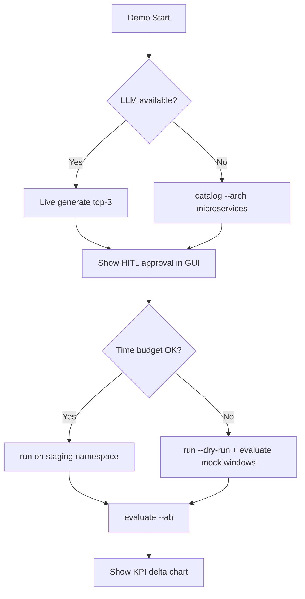

---

## Phụ lục

### A. Technology Stack Summary

| Category | Technologies |
|----------|--------------|
| Language | Python 3.10+ |
| CLI | Click |
| GUI | PySide6, PySide6-Fluent-Widgets |
| Schemas | Pydantic v2 |
| State machine | transitions |
| ML | scikit-learn, pandas, numpy |
| LLM | ollama, openai, anthropic, groq, instructor |
| Graph | NetworkX |
| K8s | kubernetes Python client |
| Testing | pytest, pytest-cov, locust |
| Container | Docker, docker-compose |

### B. Integrated Chaos Tools

| Module | Target environment | Fault types |
|--------|-------------------|-------------|
| Chaos Toolkit | Generic | Declarative experiments |
| Kube-Monkey | Kubernetes | Random pod termination |
| Pumba | Docker | kill, pause, netem |
| Chaos Monkey | AWS EC2 | Instance termination |
| Toxiproxy | TCP services | Latency, loss, timeout |
| Muxy | HTTP/TCP | Fault injection |

### C. Tài liệu liên quan trong repo

| File | Nội dung |
|------|----------|
| `README.md` | Quick start & user guide |
| `.cursor/plans/(dont touch) system_architecture_flow.plan.md` | Chi tiết flow từng component |
| `examples/advanced-config.yaml` | Cấu hình module đầy đủ |
| `docs/IT_PROJECT_PROPOSAL.md` | Tài liệu này |

### D. Câu hỏi hội đồng thường gặp — Gợi ý trả lời

| Câu hỏi | Điểm trả lời then chốt |
|---------|------------------------|
| *Vì sao không dùng microservices?* | Control plane CLI monolith giảm operational overhead; domain tách package rõ ràng; có thể tách API sau |
| *AI sai thì sao?* | HITL + SafetyPolicy + DMS; AI chỉ rank đề xuất |
| *Dữ liệu lưu ở đâu?* | Config local + telemetry external; không duplicate time-series |
| *Khác Chaos Mesh/Litmus?* | ChaosGen **orchestrates & generates** scenarios across heterogeneous tools + observability-aware ranking |
| *Đo lường hiệu quả chaos?* | `KPITracker` + `ABComparator` trên cửa sổ pre/during/post |

---

*Document generated for academic defense and technical stakeholder review. Diagrams render in GitHub, GitLab, VS Code (Markdown Preview Mermaid), and most modern Markdown viewers.*
