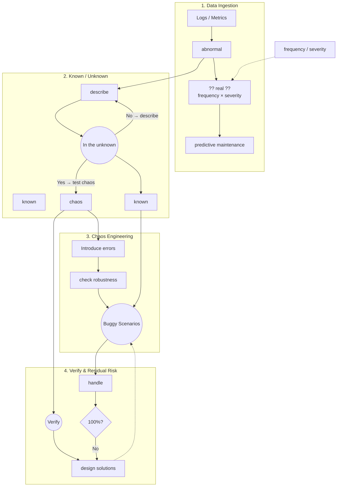
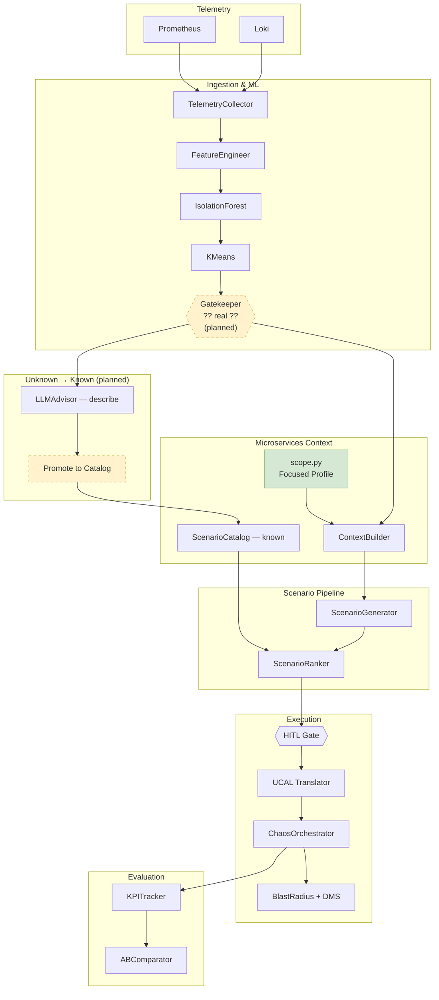

# ChaosGen Pipeline Framework

> **Scope (current):** Microservices-first. Hybrid discovery is temporarily disabled;
> other architecture types will be added incrementally.

This document maps the **advisor research framework** to the **ChaosGen implementation**.

---

## Figure 1 — Research Framework (Advisor)

Conceptual model: anomaly ingestion → incident validation → knowledge refinement → chaos → verify → iterate.

---

## Figure 2 — ChaosGen Implementation (Microservices Focus)

Same logic, bound to current modules. Dashed boxes are **planned**.

---

## Scope Matrix

| Architecture | Discovery | Catalog | LLM Advisor | Status |
|--------------|-----------|---------|-------------|--------|
| **Microservices** | Static profile | Yes | Yes | **Active** |
| Monolith | — | Partial | Partial | Planned |
| Event-driven | — | Partial | Partial | Planned |
| Client-server | — | — | Partial | Planned |
| Serverless | — | — | Partial | Planned |

Re-enable full discovery: set `DISCOVERY_ENABLED = True` in `chaosgen/config/scope.py`.

---

## Module Mapping

| Advisor concept | ChaosGen module | Status |
|-----------------|-----------------|--------|
| Logs → abnormal | `ingestion/` + `ml/anomaly_detector.py` | Implemented |
| frequency × severity | `config/scope.py` + gatekeeper | **Planned** |
| ?? real ?? | Gatekeeper layer | **Planned** |
| In the unknown → describe | `advisor/llm_advisor.py` | Partial |
| known | `advisor/scenario_catalog.py` | Implemented |
| chaos → Introduce errors | `orchestrator.py` + `modules/` | Implemented |
| Verify | `ucal/validation.py` | Partial |
| 100%? → No loop | HITL + `safety/governance.py` | Implemented |
| predictive maintenance | `evaluation/` + history DB | Partial |
