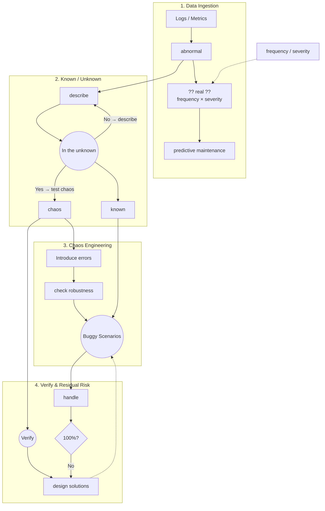
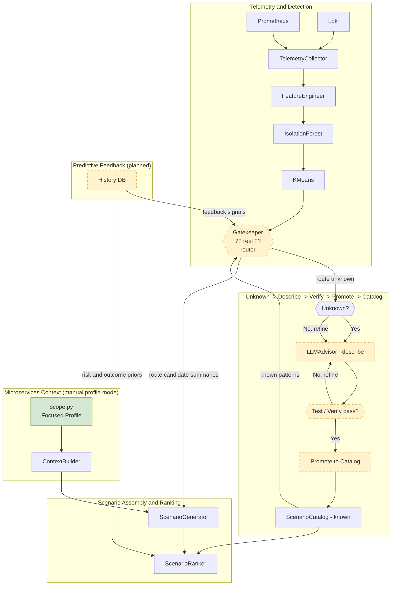
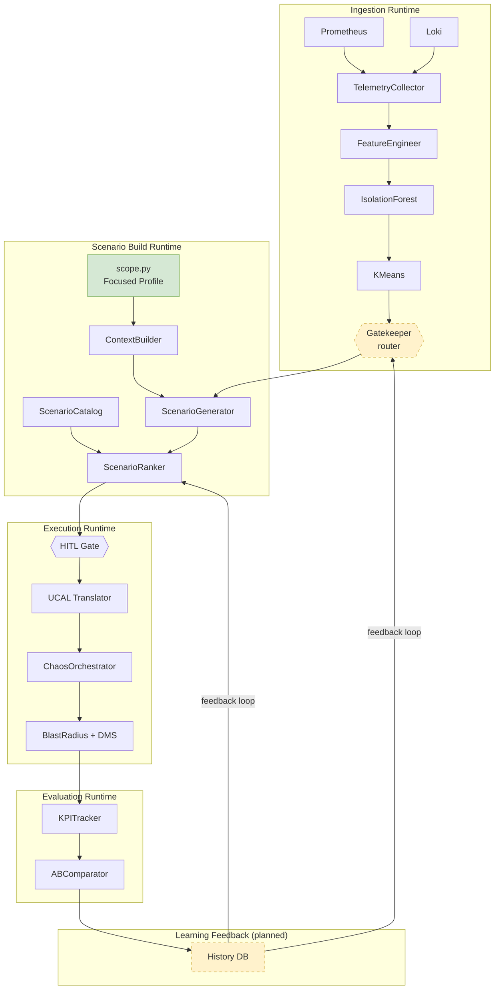

# ChaosGen Pipeline Framework

> **Scope (current):** Microservices profile mode only. Architecture auto-discovery
> (microservices/monolith/serverless classification) is deferred to a later phase.

This document maps the **advisor research framework** to the **active ChaosGen implementation**.

Figure 2 instantiates the advisor's framework (Figure 1) within ChaosGen — same logic,
different notation: advisor terminology in Figure 1, module names in Figure 2A/2B.

---

## Advisor Source Diagram (Original Sketch)

Hand-drawn workflow provided by the research advisor (28 May 2026). This is the
**conceptual source of truth**; Figures 1 and 2 below are formalized interpretations,
not pixel-perfect copies.

> **Local sketch only:** the scanned advisor diagram is kept on the author's machine
> as `docs/assets/advisor-workflow.png` and is **gitignored** (not part of the public
> repository). Use Figures 1 and 2 in this document as the committed reference.

*Caption (original sketch):* anomaly ingestion (`frequency / severity`, `?? real ??`),
knowledge loop (`In the unknown` → `describe` → `known`), chaos injection
(`Introduce errors` → Buggy Scenarios), and residual-risk iteration
(`Verify` → `design solutions` → `handle` → `100%?` → No).

---

## Figure 1 — Research Framework (Advisor)

Conceptual model: anomaly ingestion → incident validation → knowledge refinement → chaos → verify → iterate.

---

## Figure 2 — ChaosGen Implementation (Microservices Focus)

Same logic as Figure 1, split into two views for operational clarity:
- Figure 2A: advisor-aligned knowledge and data flow.
- Figure 2B: runtime component and execution flow.

### Diagram legend

| Visual | Meaning |
|--------|---------|
| **Solid box** | Implemented in current codebase |
| **Dashed border** (`stroke-dasharray`) | Planned (not yet implemented) — see [Implementation status](#figure-2-implementation-status) |
| **Green scope box** | Active microservices profile mode (`scope.py`) |

Update these diagrams after each implementation phase (P1–P5): move a module from
dashed to solid when its phase is complete.

### Figure 2 — Implementation status

| Module (Figure 2A/2B) | Phase | Status |
|-----------------------|-------|--------|
| TelemetryCollector, FeatureEngineer, IsolationForest, KMeans | — | Implemented |
| Gatekeeper `?? real ??` | P1 | Implemented |
| LLMAdvisor (hypothesis generation) | — | Implemented / Active |
| ScenarioDescriber + Promote to Catalog | P2, P3 | Implemented |
| run_advisor_pipeline (P4 CLI/GUI wire) | P4 | Implemented |
| scope.py (manual microservices profile), ContextBuilder, ScenarioCatalog | — | Implemented |
| ScenarioGenerator, ScenarioRanker | — | Implemented |
| HITL, UCAL, Orchestrator, BlastRadius + DMS | — | Implemented |
| KPITracker, ABComparator | — | Implemented |
| SQLite history feedback loop | P5 | **Implemented** (`history.db` analytics; JSON remains runtime SOT) |

<!-- MODIFIED: Split Figure 2 into Figure 2A and Figure 2B for advisor alignment + runtime clarity -->
### Figure 2A — Advisor-Aligned Knowledge/Data Flow

<!-- MODIFIED: Added runtime-focused flow to separate execution semantics from advisor knowledge loop -->
### Figure 2B — Runtime Component Flow

### Diagram rationale

The split keeps Figure 2A focused on advisor semantics (knowledge maturation and catalog
promotion) while Figure 2B captures runtime execution semantics (component orchestration,
HITL, safety, and evaluation). This separation removes data-flow ambiguity while preserving
the same active microservices profile mode and module terminology.

---

## Scope Matrix (Current Phase)

| Runtime mode | Profile source | Catalog | LLM Advisor | Status |
|--------------|----------------|---------|-------------|--------|
| **Microservices** | `scope.py` manual profile | Yes | Hypothesis generation active; describe/promote planned | **Active** |
| Monolith / Event-driven / Client-server / Serverless | Deferred | Deferred | Deferred | Deferred |

Architecture auto-discovery and multi-architecture runtime are intentionally deferred.

---

## Module Mapping

| Advisor concept | ChaosGen module | Status |
|-----------------|-----------------|--------|
| Logs → abnormal | `ingestion/` + `ml/anomaly_detector.py` | Implemented |
| frequency × severity | `ml/gatekeeper.py` | **Implemented** |
| ?? real ?? | `ml/gatekeeper.py` | **Implemented** |
| Hypothesis generation | `advisor/llm_advisor.py` | Implemented / Active |
| In the unknown → describe + promote | `advisor/scenario_describer.py` + `catalog_promoter.py` | Implemented |
| P4 pipeline wire | `advisor/pipeline.py` + CLI `incidents`/`promote` | Implemented |
| known | `advisor/scenario_catalog.py` | Implemented |
| chaos → Introduce errors | `orchestrator.py` + `modules/` | Implemented |
| Verify | `ucal/validation.py` | Partial |
| 100%? → No loop | HITL + `safety/governance.py` | Implemented |
| predictive maintenance | `evaluation/` + history DB | Partial |
